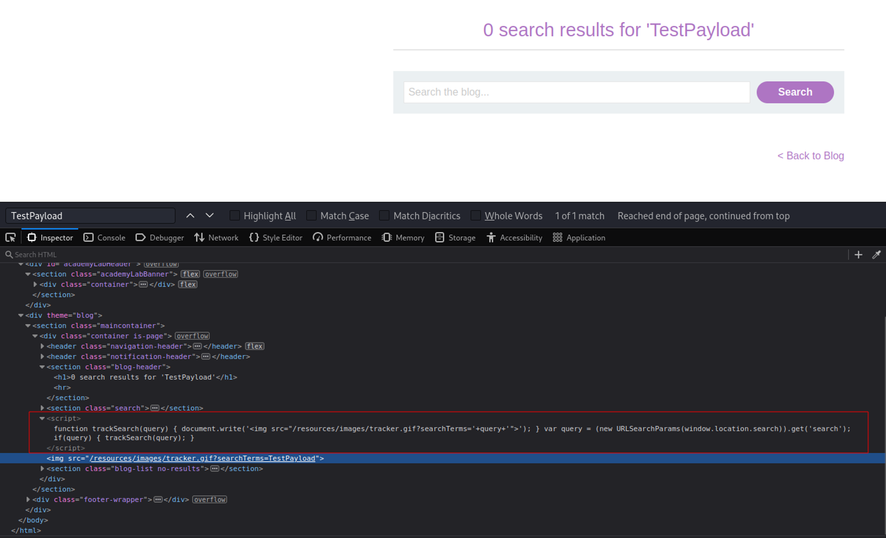
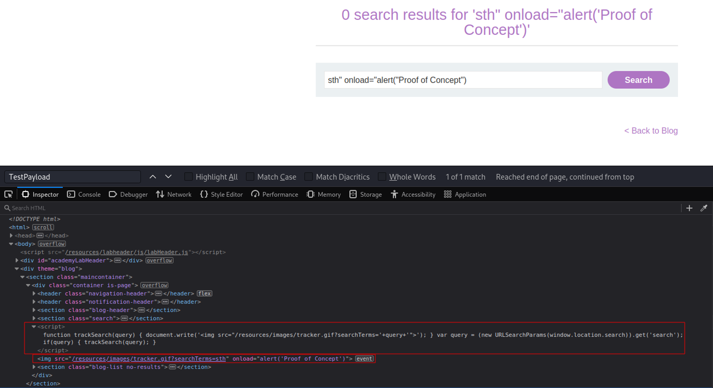

# DOM XSS in document.write sink using source location.search
# Objective
This lab contains a DOM-based cross-site scripting vulnerability in the search query tracking functionality. It uses the JavaScript `document.write` function, which writes data out to the page. The `document.write` function is called with data from `location.search`, which you can control using the website URL.\
\
To solve this lab, perform a cross-site scripting attack that calls the alert function.

# Solution
Sink - delivery method - function that allows attacker to execute arbitrary javascript code (perform DOM-based SQL injection).

## Test payload
||
|:--:| 
| *TestPayload* |

## XSS
The following payload triggers `alert()`:
```
sth" onload="alert("Proof of Concept")
```


