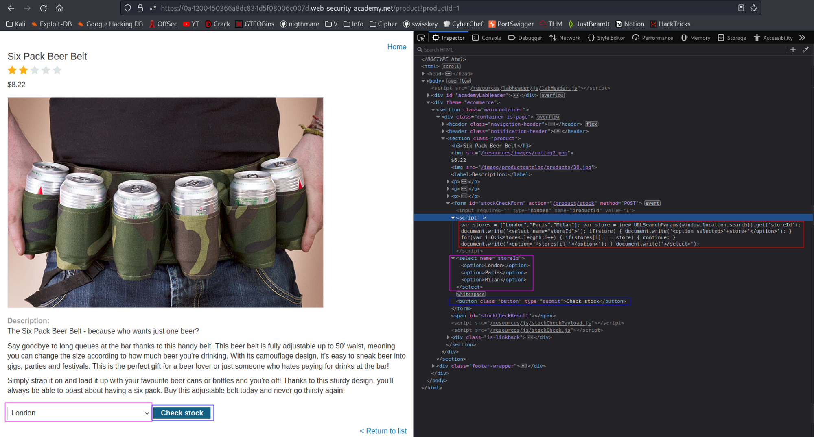
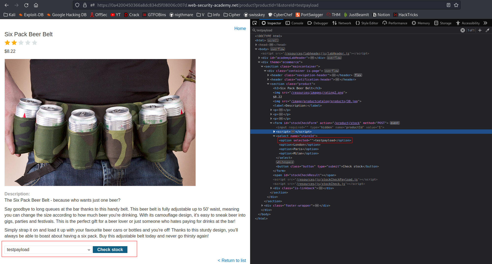
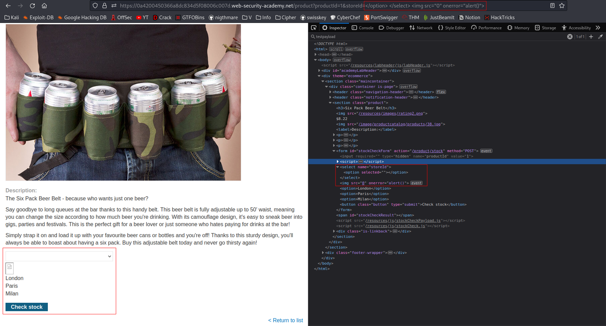
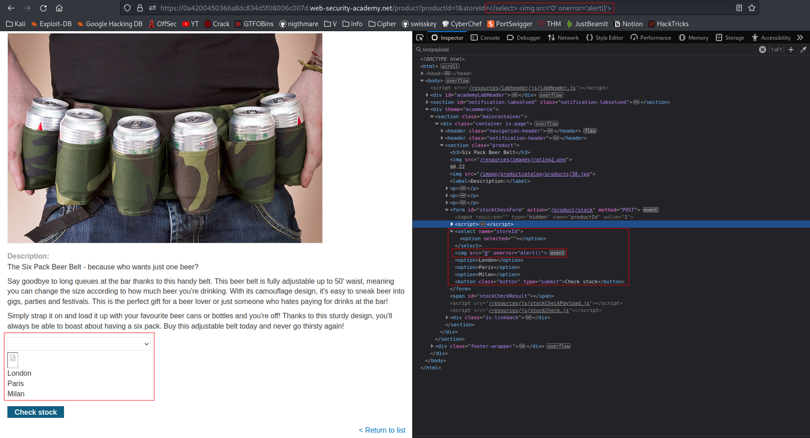

# DOM XSS in document.write sink using source location.search inside a select element
# Objective
This lab contains a DOM-based cross-site scripting vulnerability in the stock checker functionality. It uses the JavaScript document.write function, which writes data out to the page. The document.write function is called with data from location.search which you can control using the website URL. The data is enclosed within a select element.\
\
To solve this lab, perform a cross-site scripting attack that breaks out of the select element and calls the alert function.

# Solution
## Analysis
||
|:--:| 
| *Check stock funcionality* |

Code below shows script that gets `storeId` value from URL and stores it in store variable. Then if store value is unique (not present in stores array) it is added to options and chosen as currently selected. Payload: 
```
$ip/product?productId=1&storeId=testpayload
```

By providing `storeId` value in URL it is possible to add another option location to check stock.
||
|:--:| 
| *Test payload - added option* |

In order to exploit the vulnerability of this website the payload must be constructed in the way that it will break out of selected tag and use for example ``.

## XSS
The following payload triggers `alert()`:
```
$ip/product?productId=1&storeId=</option> </select> 
```


Moreover if `<option>` wasn’t closed it would be closed automatically, therefore the following payload would also work:
```
$ip/product?productId=1&storeId=</select> 
```
