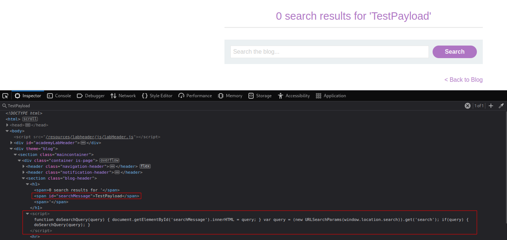

# DOM XSS in innerHTML sink using source location.search
# Objective
This lab contains a DOM-based cross-site scripting vulnerability in the search blog functionality. It uses an `innerHTML` assignment, which changes the HTML contents of a `div` element, using data from `location.search`.

To solve this lab, perform a cross-site scripting attack that calls the alert function.

# Solution
Sink - delivery method - function that allows attacker to execute arbitrary javascript code (perform DOM-based SQL injection).

## Test payload
||
|:--:| 
| *TestPayload* |

## XSS
The following payload triggers `alert()`:
```

```


