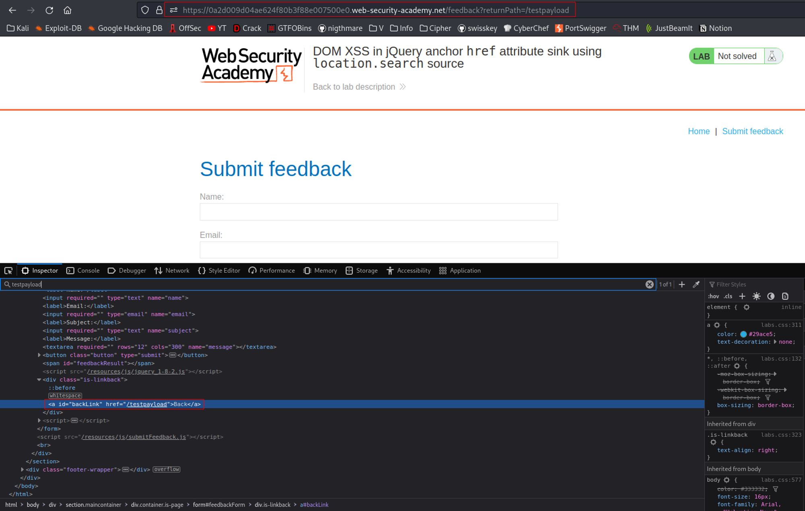
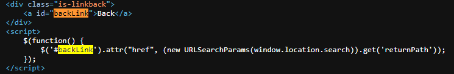
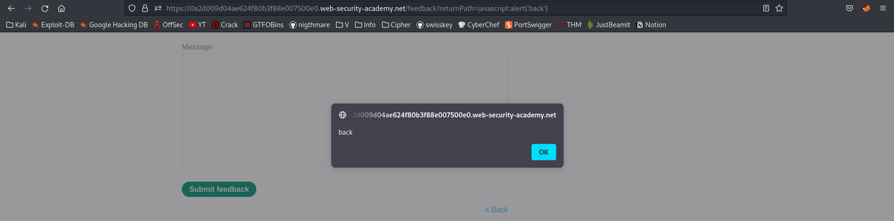

# DOM XSS in jQuery anchor href attribute sink using location.search source
# Objective
This lab contains a DOM-based cross-site scripting vulnerability in the submit feedback page. It uses the jQuery library's `$` selector function to find an anchor element, and changes its `href` attribute using data from `location.search`.

To solve this lab, make the "back" link alert `document.cookie`.

# Solution
Sink - delivery method - function that allows attacker to execute arbitrary javascript code (perform DOM-based SQL injection).

## Analysis
||
|:--:| 
| Payload: `$ip/feedback?returnPath=/testpayload` |
||
| *Vulnerable function* |

## XSS Exploit
The following payload triggers `alert()` when user cliks on the back button:
```
$ip/feedback?returnPath=javascript:alert('back')
```
||
|:--:| 
| Payload: `$ip/feedback?returnPath=/testpayload` |

