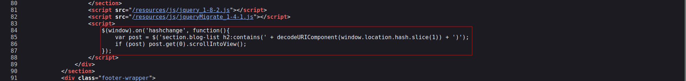
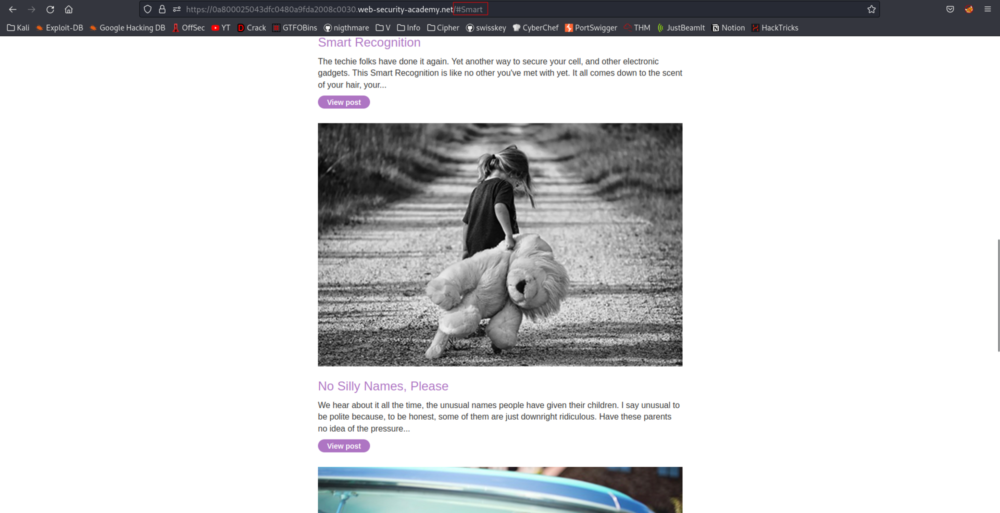
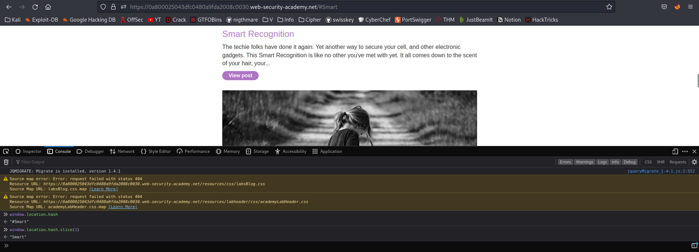
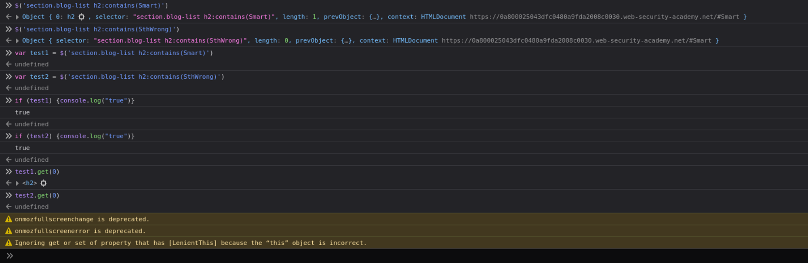
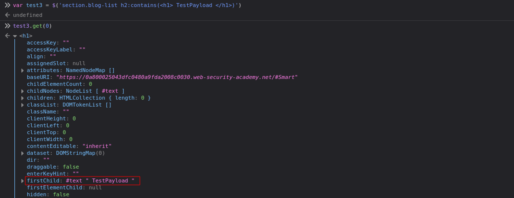
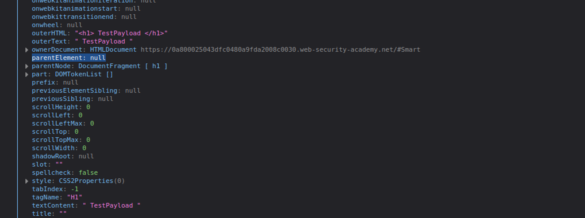
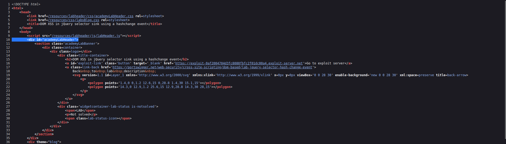
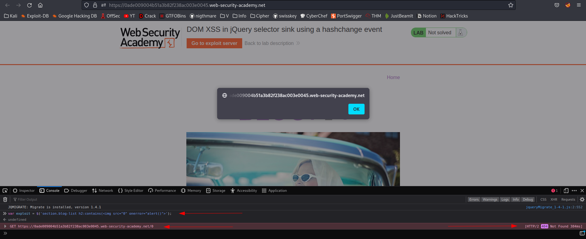
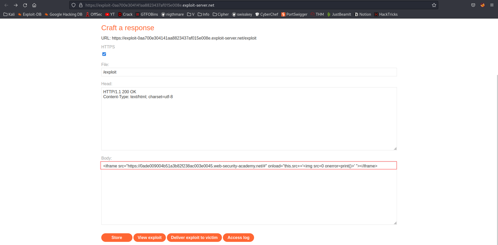

# DOM XSS in jQuery selector sink using a hashchange event
# Objective
This lab contains a DOM-based cross-site scripting vulnerability on the home page. It uses jQuery's `$()` selector function to auto-scroll to a given post, whose title is passed via the `location.hash` property.\
\
To solve the lab, deliver an exploit to the victim that calls the `print()` function in their browser.

# Solution
## Analysis

||
|:--:| 
| *Vulnerable function* |

After providing a correct value in URL for example: `/#Smart` website is scrolled to the adequate paragraph.
||
|:--:| 
| *Example - `/#Smart`* |
||
| *Vulnerable function* |

Analizing both cases (where element exists and does not exist) shows that both `test1` and `test2` returns true even though `test2` has `lenght=0`.
||
|:--:| 
| *`Test2` returns true even though `SthWrong` does not exists* |

After providing value: `<h1> TestPayload </h1>` h1 element exists but it can not be seen on website because it does not have any parent element (`test3` is detached DOM element).

||
|:--:| 
||

After attaching `test3` to academyLabHeader test text was presented at the website.

||
|:--:| 
||

## XSS
The creation of the `` and giving it incorrect source destination like `src=0` makes browser to send request `$ip/0`, even though the image is detached from the DOM.
In order to exploit this vulnerability an image request can be made - if image with given name does not exists (`onerror`) function like `alert()` can be called. The `` is detached from the DOM.
||
|:--:| 
| *Payload with `alert()`* |
The same result can be achieved by sending following request:
```
$ip/#
```

Final payload:
```
<iframe src="https://$ip#" onload="this.src+='' "></iframe>
```
`this.src+=` -> During loading of `iframe` image tag is appended to source tag (URL)

||
|:--:| 
| *Final payload* |