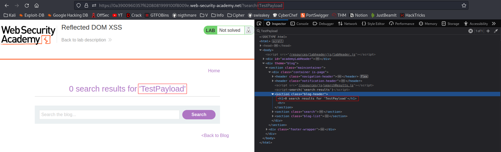
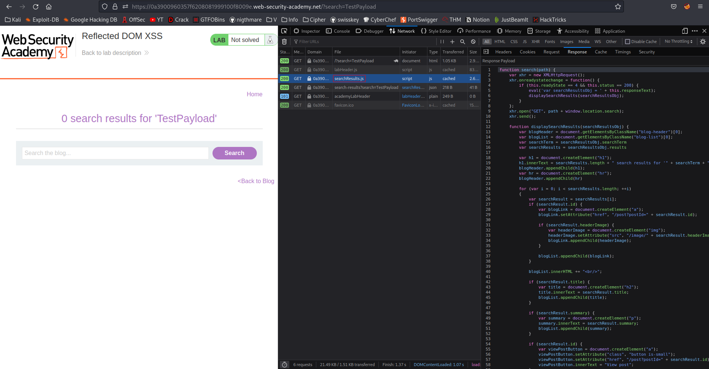
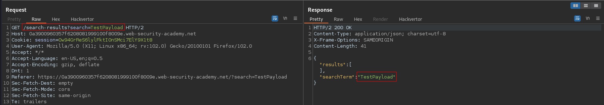
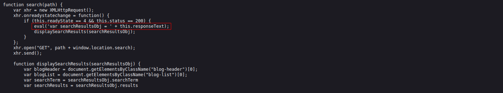
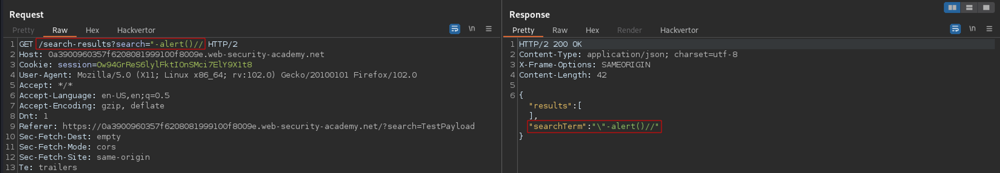
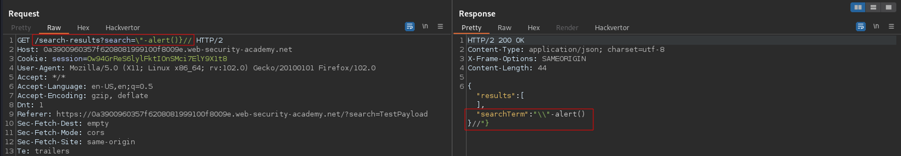
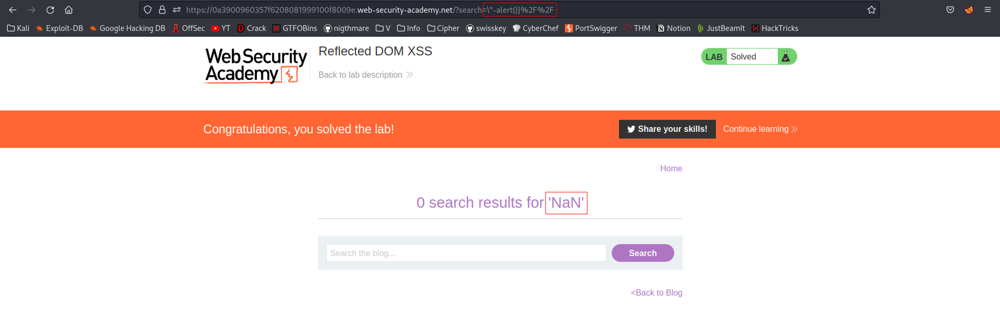

# Reflected DOM XSS
# Objective
This lab demonstrates a reflected DOM vulnerability. Reflected DOM vulnerabilities occur when the server-side application processes data from a request and echoes the data in the response. A script on the page then processes the reflected data in an unsafe way, ultimately writing it to a dangerous sink.

To solve this lab, create an injection that calls the `alert()` function.

# Solution
## Analysis
The following payload appears only in one place on the page.
||
|:--:| 
| *Test payload* |

JavaScript code is included in `searchResult.js` file that was downloaded while loading the page. It can be also found at `$ip/resources/js/searchResults.js`

||
|:--:| 
| `searchResult.js` |

Response includes search term in JSON format:
||
|:--:| 
| *Response for test payload* |

The payload below shows the returned JSON values that are later evaluated by `eval()` function:
```
$ip/?search=TestPayload
```
||
|:--:| 
| *Response for test payload* |

`eval()` - evaluates JavaScript code represented as a string

||
|:--:| 
| *Vulnerable code* |

## XSS Exploit
In order to execute `alert()` it is necessary to break out of the JSON:
- Character `-` is used because it doesn’t have to be URL encoded and thus is more convenient than `+`
- Break out of string using  `"`  (`"` will be automatically escaped by  `\` ).
- Therefore this slash character (`\`) also will have to be escaped by another `\`.
- Close JSON with `}` 
- The rest should be commented out by `//`

Example (`"`  was escaped automatically):
||
|:--:| 
| *Example* |

The following payload triggers `alert()`:
```
$ip/?search=\"-alert()}//
```

||
|:--:| 
||
