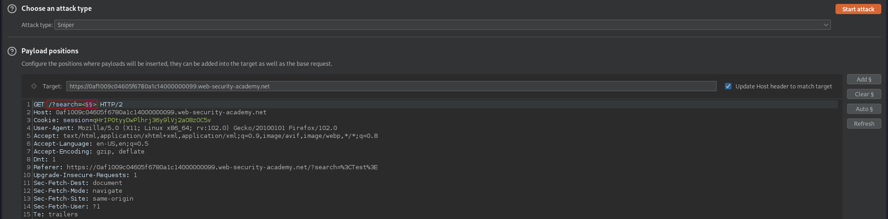
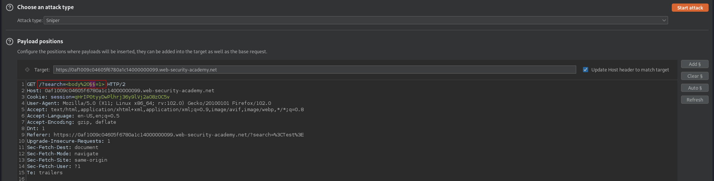

# Reflected XSS into HTML context with most tags and attributes blocked
# Objective
This lab contains a reflected XSS vulnerability in the search functionality but uses a web application firewall (`WAF`) to protect against common XSS vectors.\
\
To solve the lab, perform a cross-site scripting attack that bypasses the `WAF` and calls the `print()` function.

# Solution
## Analysis
Payload: `TestPayload` doesn’t show anything interesting.
||
|:--:| 
| *Test payload* |

Payload: `` returns error `"Tag is not allowed"`.
||
|:--:| 
| *Test payload* |

## XSS Exploit
[Tags and Events used for brute forcing (Copy tags to clipboard)](https://portswigger.net/web-security/cross-site-scripting/cheat-sheet)

### Brute forcing tag
||
|:--:| 
| *Payload position* |
||
| Working tag: `<body>` |

### Brute forcing event
`%20` - is just space URL encoded
||
|:--:| 
| *Payload position* |
||
| Working events - for example `onresize` |

### Brute forcing event
Payload below is triggered when user changes the size of the browser window:
```
<body onresize='print()'>
```
||
|:--:| 
| *Testing payload* |
||
| *Result* |

Presented above payload require user interaction. In order to perform this attack without any user interaction above payload (`<body onresize='print()'>`) must be rendered inside of iframe because it can be resized. Final Payload:
```
<iframe src="$ip/?search="><body onresize=print()>" onload=this.style.width='100px'>
```
After the iframe is loaded, it is resized and payload is triggered. 

