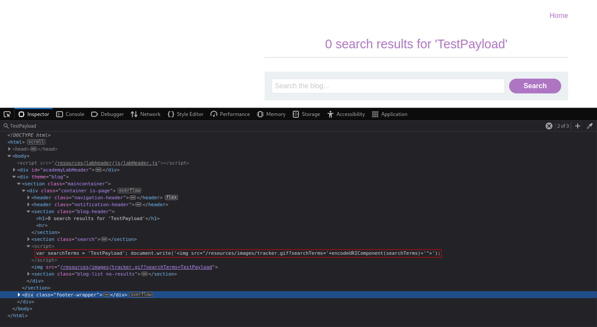
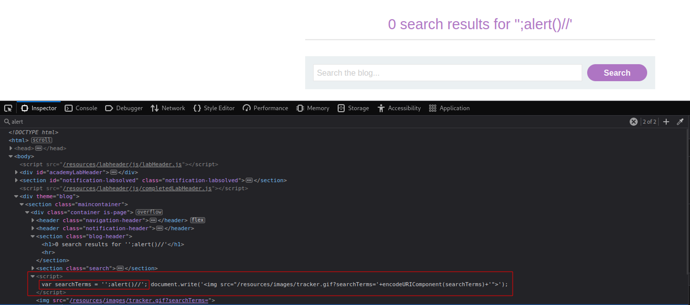

# Reflected XSS into a JavaScript string with angle brackets HTML encoded
# Objective
This lab contains a reflected cross-site scripting vulnerability in the search query tracking functionality where angle brackets are encoded. The reflection occurs inside a JavaScript string. To solve this lab, perform a cross-site scripting attack that breaks out of the JavaScript string and calls the alert function.

# Solution
## Test payload
||
|:--:| 
| *Test payload* |


## XSS
Both of two below presented payloads works (escape from javastring and execute `alert()` function):
```
'-alert()-'
OR
';alert()//
```

||
|:--:| 
||

