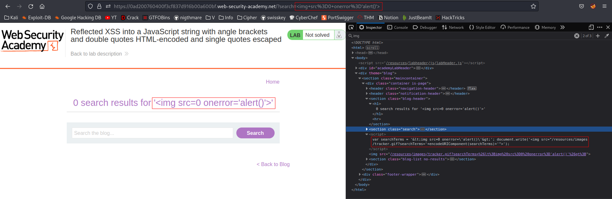
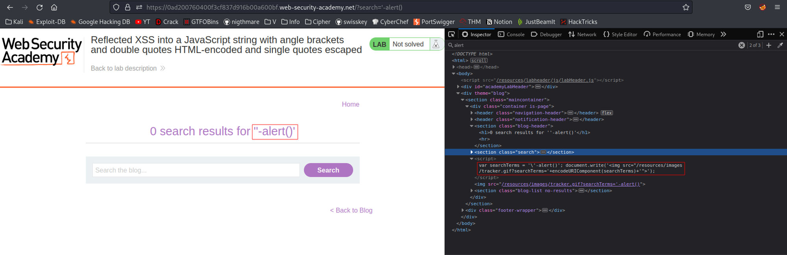
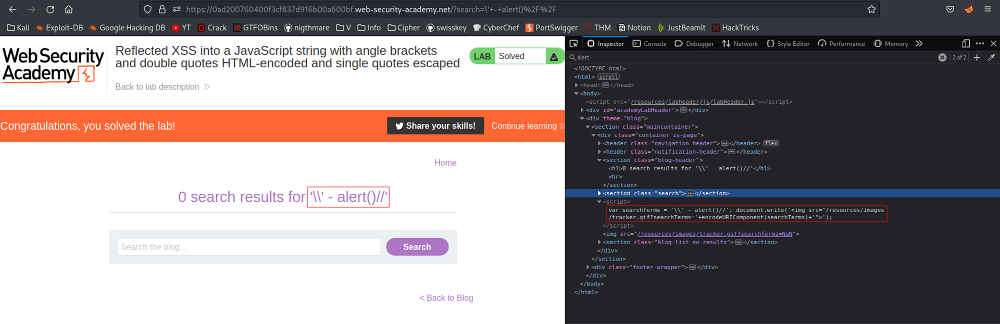

# Reflected XSS into a JavaScript string with angle brackets and double quotes HTML-encoded and single quotes escaped
# Objective
This lab contains a reflected cross-site scripting vulnerability in the search query tracking functionality where angle brackets and double are HTML encoded and single quotes are escaped.\
\
To solve this lab, perform a cross-site scripting attack that breaks out of the JavaScript string and calls the alert function.

# Solution
## Analysis
Payload: ``
||
|:--:| 
| *Test payload* |

As it was mentioned in the description of this lab angle brackets are HTML encoded and single quotes are escaped.

Payload: `'-alert()`
||
|:--:| 
| Single quotes escaped using `\` character. |

## XSS Exploit

In order to perform this XSS attack successfully:
- Escape character must be escaped
- The rest of the query must be commented out

The following payload triggers `alert()`
```
\' - alert()//
```


