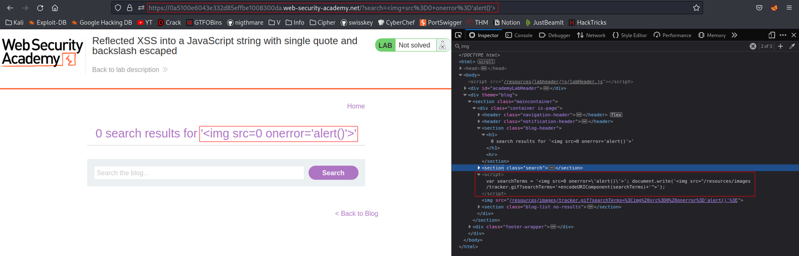
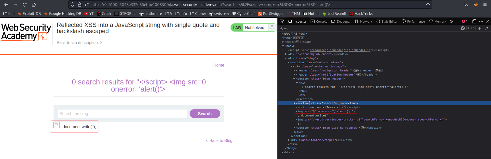
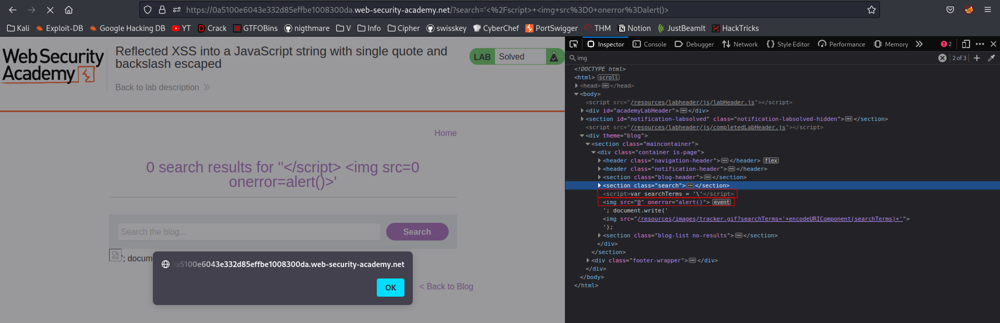
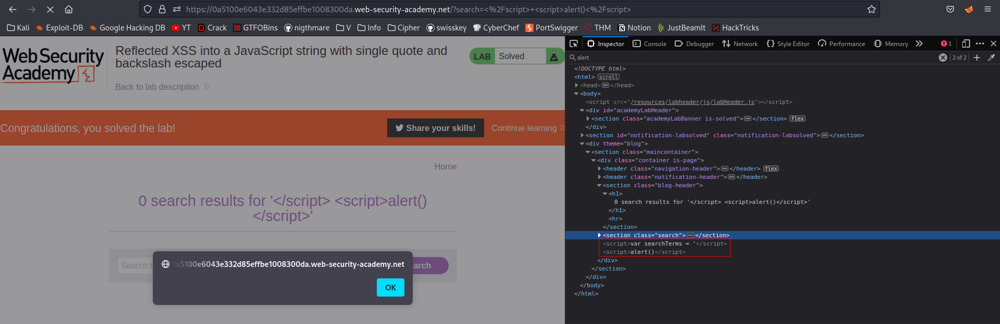

# Reflected XSS into a JavaScript string with single quote and backslash escaped
# Objective
This lab contains a reflected cross-site scripting vulnerability in the search query tracking functionality. The reflection occurs inside a JavaScript string with single quotes and backslashes escaped.\
\
To solve this lab, perform a cross-site scripting attack that breaks out of the JavaScript string and calls the alert function.

# Solution
## Analysis
Test payload:
```

```
||
|:--:| 
| *Test payload* |

Above test shows that in order to call alert() function payload must break out of the JavaScript string, break out of `<script>` tag and avoid character `'` being escaped with `/`.

## XSS Exploit
Payload: `'</script> ` - character `'` was escaped.



In order to perform attack successfully character `'` can be omitted.

Payload: `'</script> `



A simpler solution is to just use `<script>` tag:
Payload: `</script> <script>alert()</script>`



Another solution could be to close open `<script>` tag and open another one with `alert()` function without closing it because closing tag already exists (probably would be still closed automatically in case of absence of closing tag) and comment out rest of the JavaScript code.
Payload: `</script> <script>alert()//`

