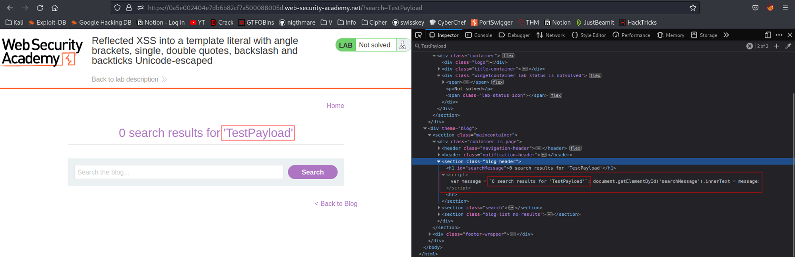
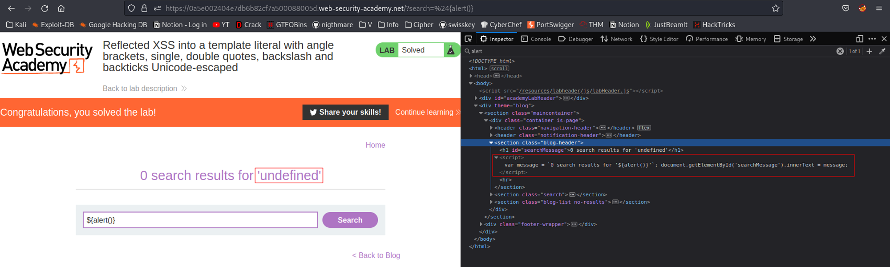

# Reflected XSS into a template literal with angle brackets, single, double quotes, backslash and backticks Unicode-escaped
# Objective
This lab contains a reflected cross-site scripting vulnerability in the search blog functionality. The reflection occurs inside a template string with angle brackets, single, and double quotes HTML encoded, and backticks escaped. To solve this lab, perform a cross-site scripting attack that calls the alert function inside the template string.

# Solution
## Analysis
||
|:--:| 
| *Test payload* |

The above screenshot show that `Template Literals (Template String)` are in use - character '\`'. They works as strings and allow use of variables without breaking multi-lines strings. In this way `alert()` function can also be called from `${alert()}`
```js
string text line 0
string text ${variable}
string text line 2
```

## XSS Exploit
```
${alert()}
```


