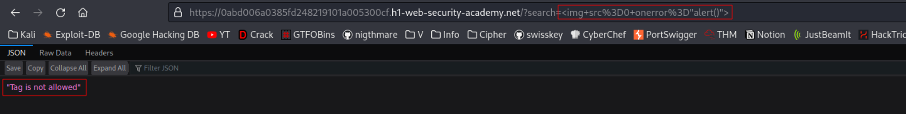
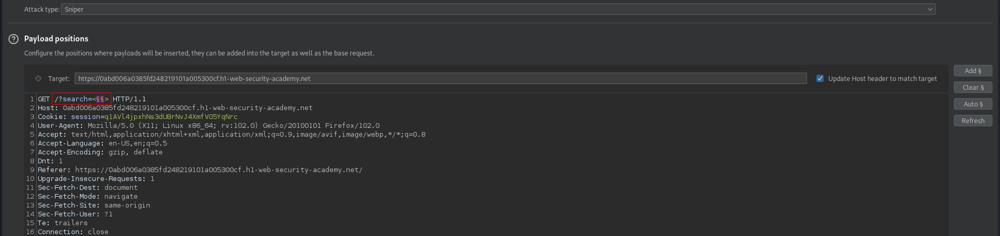
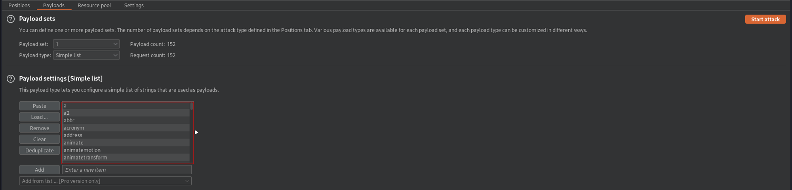
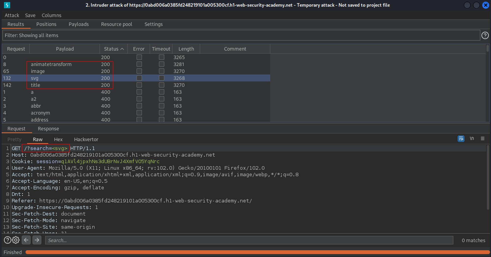
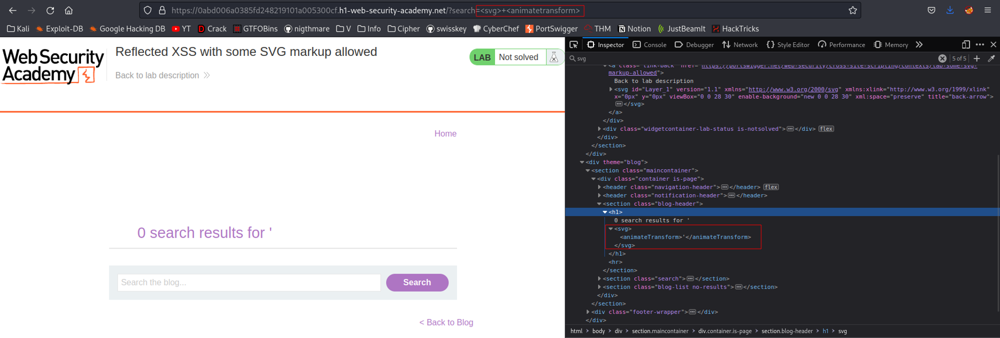
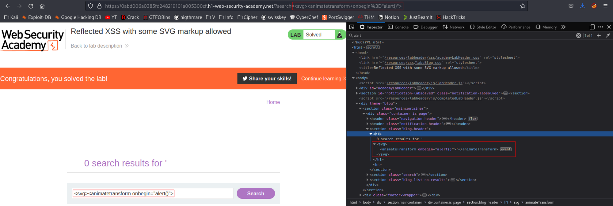

# Reflected XSS with some SVG markup allowed
# Objective
This lab has a simple reflected XSS vulnerability. The site is blocking common tags but misses some `SVG` tags and events.

To solve the lab, perform a cross-site scripting attack that calls the `alert()` function.

# Solution
## Analysis
Payload: `` returns `"Tag is not allowed"`:
||
|:--:| 
| *Test payload* |


## Brute forcing allowed tags
[Tags and Events used for brute forcing (Copy tags to clipboard)](https://portswigger.net/web-security/cross-site-scripting/cheat-sheet)
Payload: 
```
/?search=<§§>
```

||
|:--:| 
| *Payload position* |
||
| *Payload settings - payload list was copied from Cross-site scripting (XSS) cheat sheet* |
||
| *Results* |

Allowed tags are: `<animatetransform>`, `<image>`, `<svg>`, `<title>`.
Tag `<animatetransform>` can be used inside `<svg>` tag.

Both tags: `<svg>` and `<animatetransform>` can be inserted into a page.
||
|:--:| 
| Tags `<svg>` and `<animatetransform>` were inserted |

## Brute forcing allowed events
[Tags and Events used for brute forcing (Copy tags to clipboard)](https://portswigger.net/web-security/cross-site-scripting/cheat-sheet)
Payload encoded and decoded: 
```
/?search=%3Csvg%3E+%3Canimatetransform%20§§=1%3E
/?search=<svg> <animatetransform §§=1>
```
||
|:--:| 
| *Payload position* |
||
| *Payload settings - payload list was copied from Cross-site scripting (XSS) cheat sheet* |
||
| *Results* |

Only `onbegin` event returned HTTP 200 OK. In order to make this Brute-Force to work, all characters including `<` and `>` had to be URL encoded. Otherwise all responses would have HTTP 400 codes. `CTRL+U` in Burp wasn’t encoding these characters. The base request must have looked like intercepted with encoded above mentioned characters.

## XSS Exploit
Payload: 
```
<svg><animatetransform onbegin="alert()">
```



