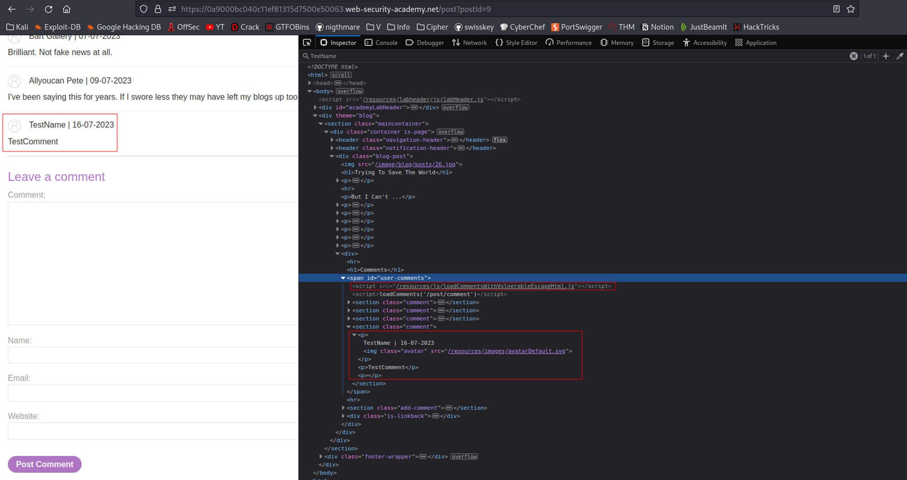
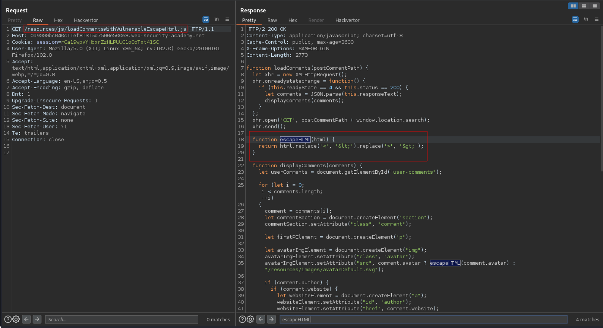
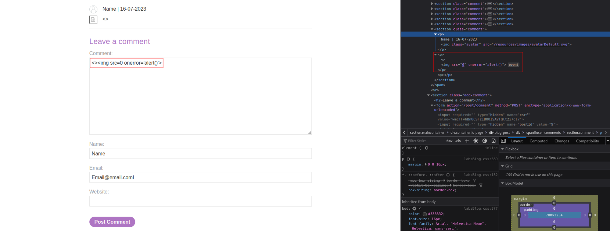

# Stored DOM XSS
# Objective
This lab demonstrates a stored DOM vulnerability in the blog comment functionality. To solve this lab, exploit this vulnerability to call the `alert()` function.

# Solution
## Analysis
||
|:--:| 
| *Test payload* |

Function `escapeHTML` from `loadCommentsWithVulnerableEscapeHtml.js` escapes characters `<` and `>`.

||
|:--:| 
| *Escape HTML funtion* |

Payload: `<a>a</a> <b>b</b> <c>c</c>` - shows that only first tag was escaped.

## XSS Exploit
The following payload triggers `alert()`:
```
<>
```
||
|:--:| 
| *Whenever somone views the comment, payload is triggered* |