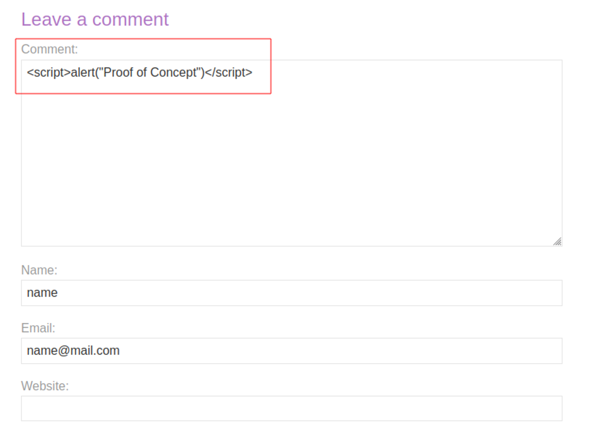

# Stored XSS into HTML context with nothing encoded
# Objective
This lab contains a stored cross-site scripting vulnerability in the comment functionality.\
\
To solve this lab, submit a comment that calls the alert function when the blog post is viewed.\

# Solution
The following payload triggers `alert()`:
```
<script>alert()</script>
```
||
|:--:| 
| *Whenever somone views the comment, payload is triggered* |