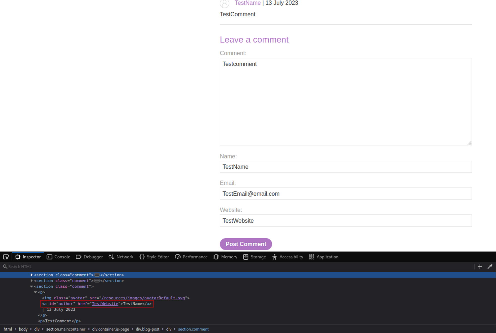
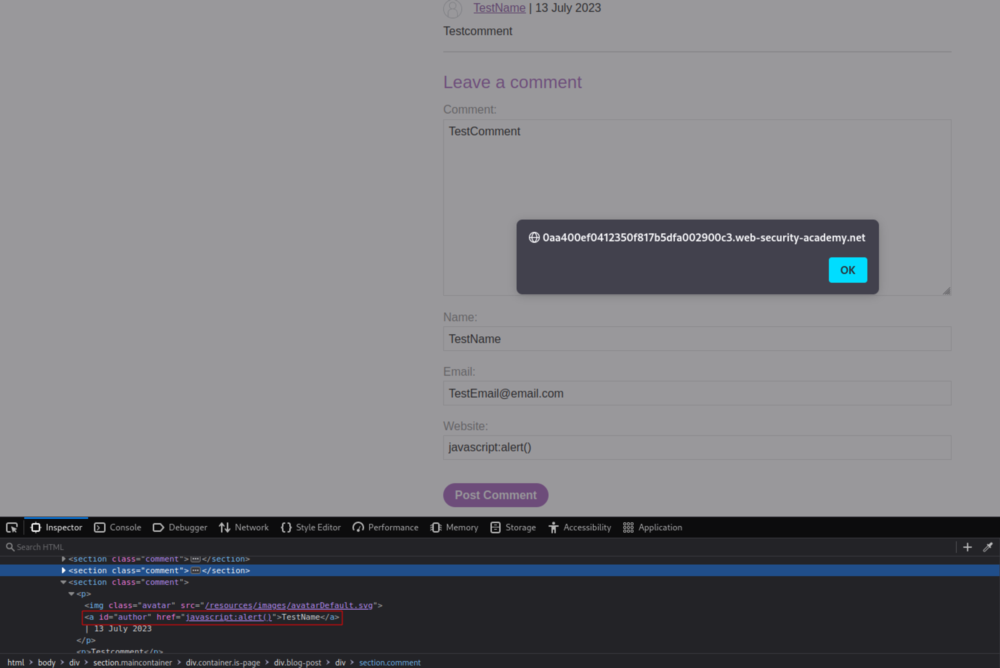

# Stored XSS into anchor href attribute with double quotes HTML-encoded
# Obejective
This lab contains a stored cross-site scripting vulnerability in the comment functionality. To solve this lab, submit a comment that calls the alert function when the comment author name is clicked.

# Solution
## Analysis
After filling all information to submit comment it is visible that created link is based on the input provided in Website field.
||
|:--:| 
| *Test payload* |

## XSS Exploit
By providing the following value: `javascript:alert()` in the Website field `username` leads to `alert()` function execution.

