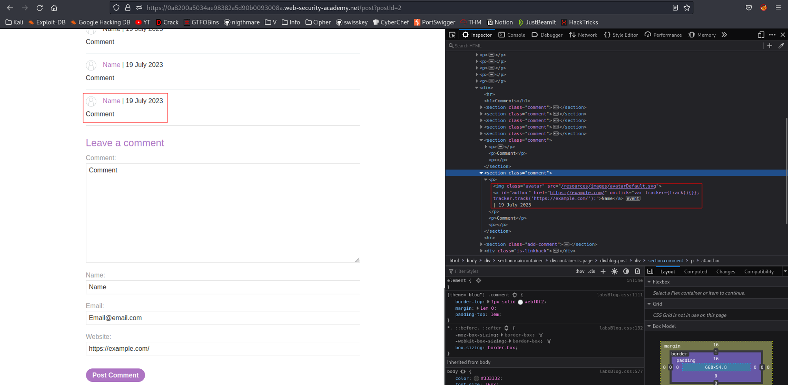
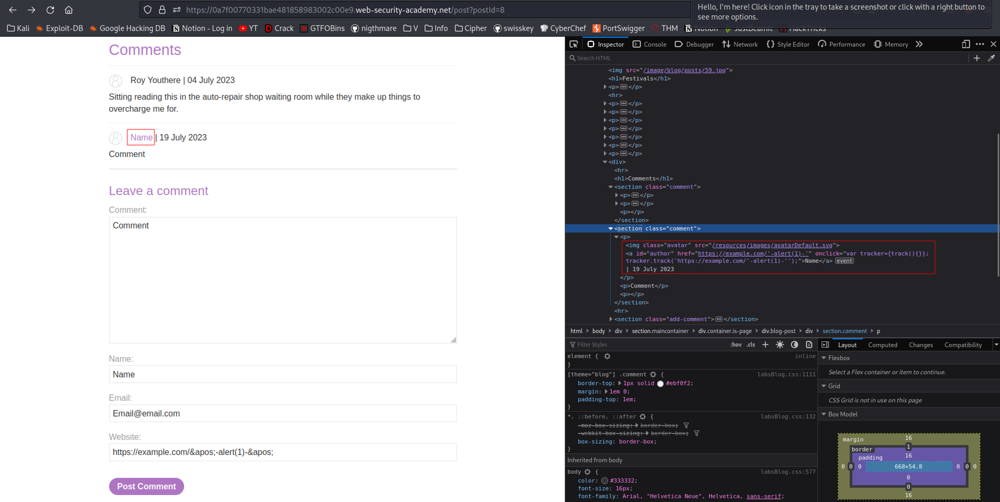
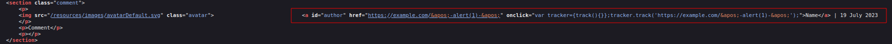

# Stored XSS into onclick event with angle brackets and double quotes HTML-encoded and single quotes and backslash escaped
# Objective
This lab contains a stored cross-site scripting vulnerability in the comment functionality.\
\
To solve this lab, submit a comment that calls the alert function when the comment author name is clicked.

# Solution
## Analysis
If user clicks on the someone’s username, user is brought to a provided website.\
Website has to start with: `http://` or `https://`

||
|:--:| 
| *Test payload* |

## XSS Exploit
Below presented JavaScript code is in HTML tag. In this lab `HTML entities` can be used to perform this XSS attack. \
Thanks to HTML entities it is possible to include character  `'`  in the payload and break out of the string.

```
https://example.com/&apos;-alert()-&apos;
```

||
|:--:| 
| *Payload* |
||
| *HTML Entities are rendered in the user’s browser (above source code of the page).* |