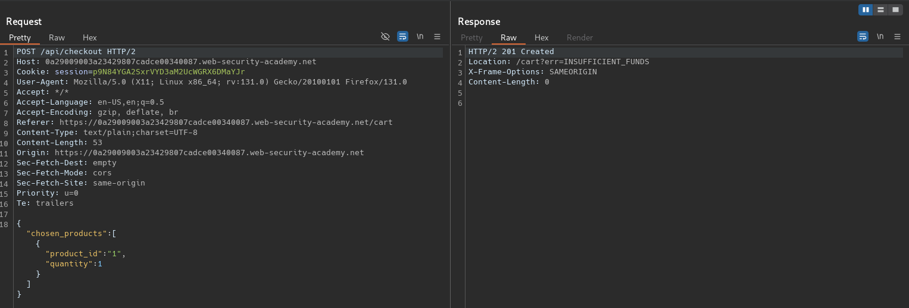
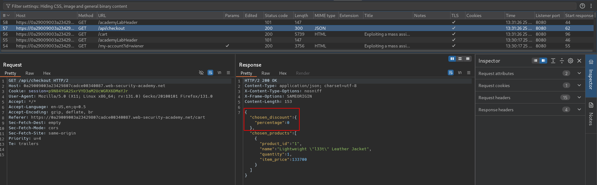
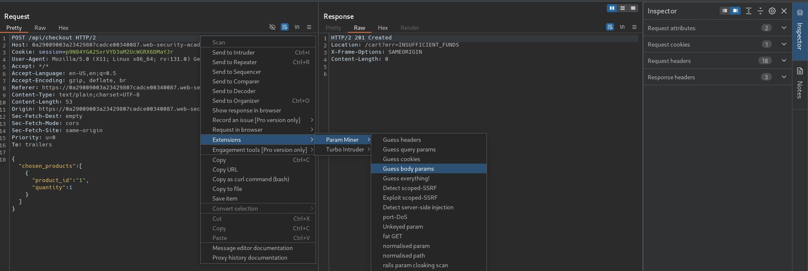
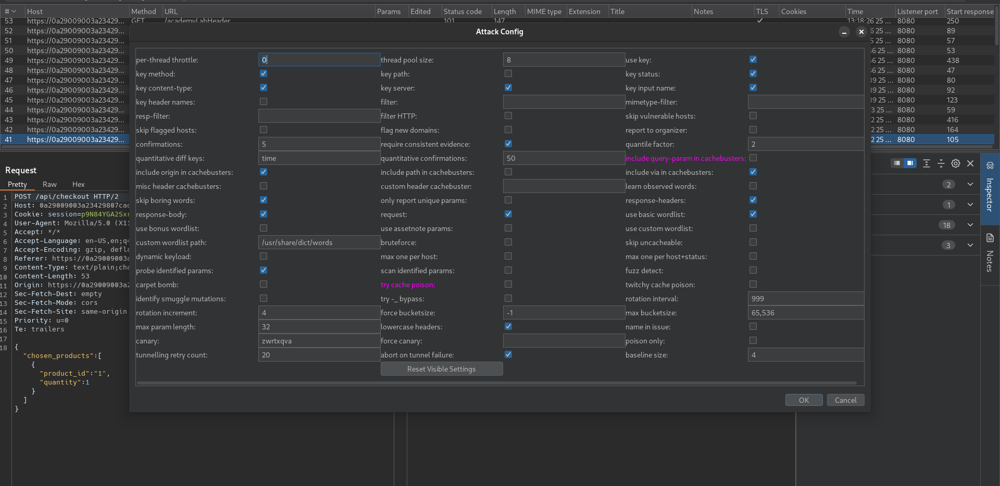
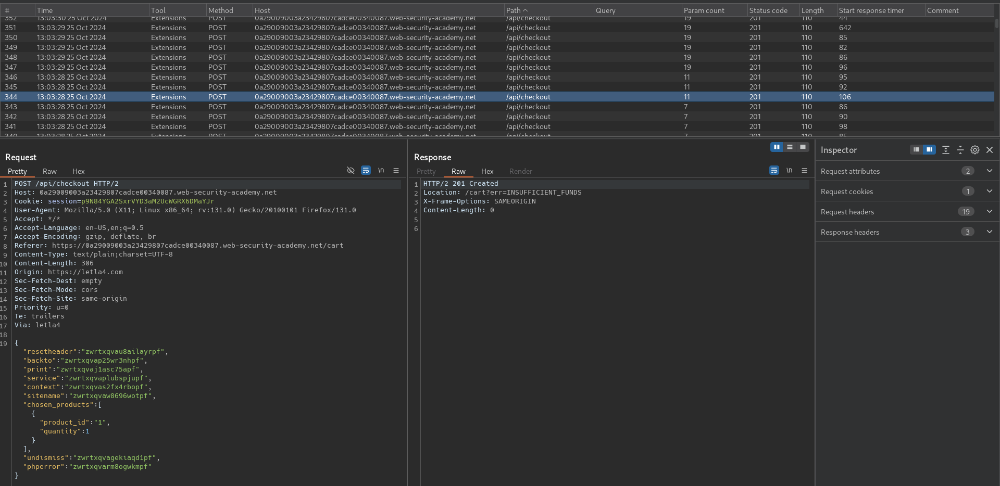
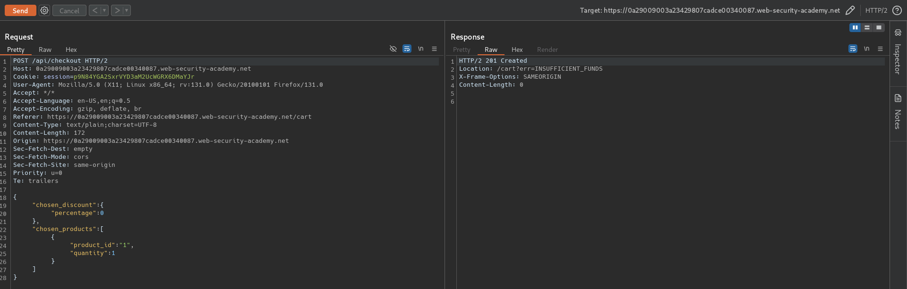
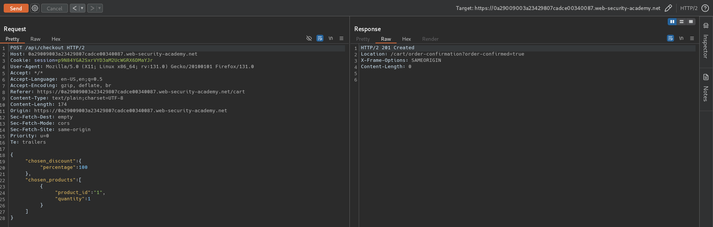

# Exploiting a mass assignment vulnerability
# Objective
To solve the lab, find and exploit a mass assignment vulnerability to buy a Lightweight l33t Leather Jacket. You can log in to your own account using the following credentials: `wiener:peter`. 

To solve this lab, you'll need to know:
- What mass assignment is.
- Why mass assignment may result in hidden parameters.
- How to identify hidden parameters.
- How to exploit mass assignment vulnerabilities.

# Solution
## Analysis
Initially application do not allow to buy item which price is above `Store credit`.
||
|:--:| 
| *Checkout request* |

The HTTP `201 Created successful` response status code indicates that the HTTP request has led to the creation of a resource. This status code is commonly sent as the result of a POST request. 

Request to `/api/checkout` shows all JSON parametrs.
||
|:--:| 
| *All JSON parametrs* |

## Exploitation
### Finding hidden parameters - Param Miner example
Param Miner enumeration shows that all requests with extra JSON parameters are accepted. Response `201 Created` indicates that mass assignment vulnerability may exist.

||
|:--:| 
| *Param Miner start* |
||
| *Param Miner configuratoin* |
||
| *Param Miner result* |

### Exploiting mass assignment vulnerability

||
|:--:| 
| *Successful request with extra parameter* |
||
| *Successful request with modified checkout parameter value* |
