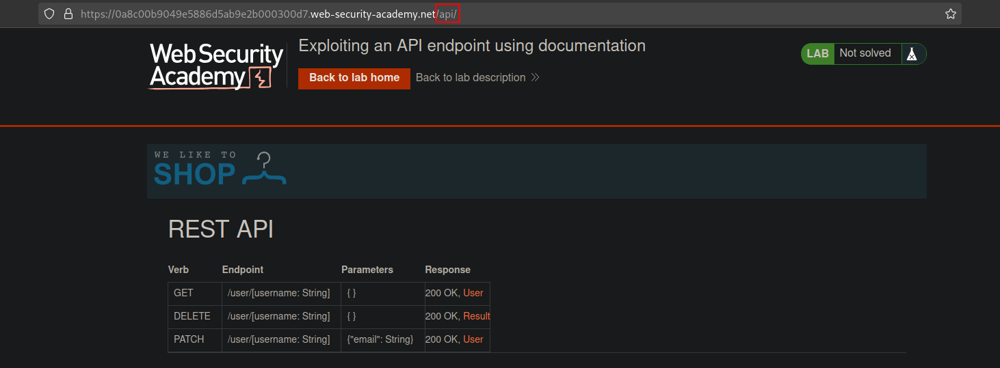
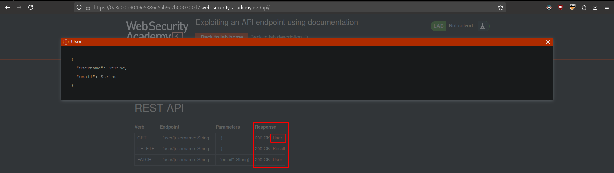
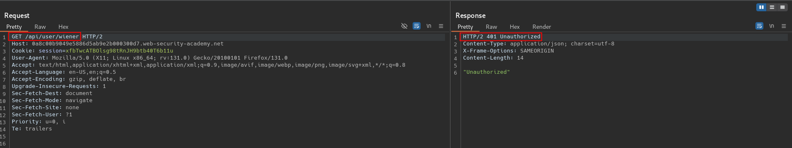
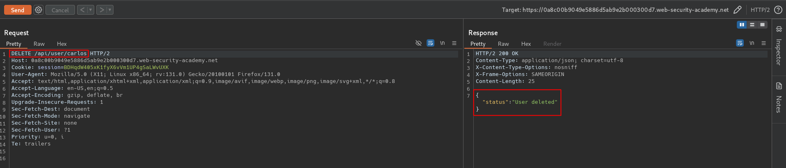

# Exploiting an API endpoint using documentation
# Objective
To solve the lab, find the exposed API documentation and delete carlos. You can log in to your own account using the following credentials: `wiener:peter`. 
To solve this lab, you'll need to know:
- What API documentation is.
- How API documentation may be useful to an attacker.
- How to discover API documentation.


# Solution
## Analysis
### Potentially interesting API (documentation) endpoints:

```
/api
/swagger/index.html
/openapi.json
```

### Identifying API endpoints
There is a API documentation at `/api`. In order to perform listed action user have to be logged in.
||
|:--:| 
| *Leaked API documentation* |
||
| *Response format* |
||
| *Request was denied - 401 Unauthorized* |

## Exploitation
Logged in user can access API endpoints.

||
|:--:| 
| *Leaked API documentation* |
||
| *Deletion of user Carlos* |
