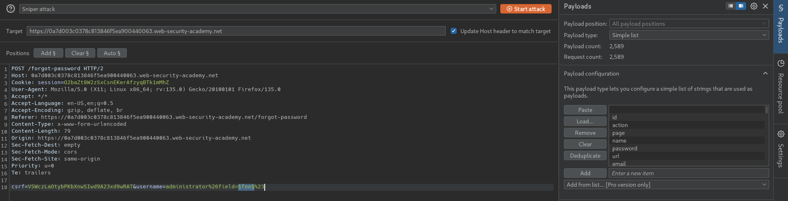

# Exploiting server-side parameter pollution in a query string
# Objective
To solve the lab, log in as the administrator and delete carlos. 

# Solution
## Analysis

||
|:--:| 
| *Password reset funcionality* |

## Exploitation
### Parameter pollution techniques
Parameter pollution techniques: 
- Truncating query strings `%23` (`#`)
- Injecting invalid parameters `%26` (`&`)
- Injecting valid parameters - finding parameters 
- Overriding existing parameters `GET /getUser?name=tom%26name=jerry`

### Parameters modificiations

[Server Side Variables Names](https://github.com/antichown/burp-payloads/blob/master/Server-side%20variable%20names.pay)

||
|:--:| 
| *Parameters modificiations - Not valid username* |
||
| *Parameters modificiations - Truncating query string* |
||
| *Parameters modificiations - Truncating query string and extra parameter* |

### Finding correct parameter name
||
|:--:| 
| *Brute forcing correct field name* |
||
| *Brute forcing correct field name - email* |
||
| *Correct parameter found from source code - reset_token* |

### Retrieval of reset password token
||
|:--:| 
| *Parameters modificiations - Truncating query string and correct parameter name* |
| *Extraction of reset password token* |
||
| *Password reset and deletion of user Carlos* |

