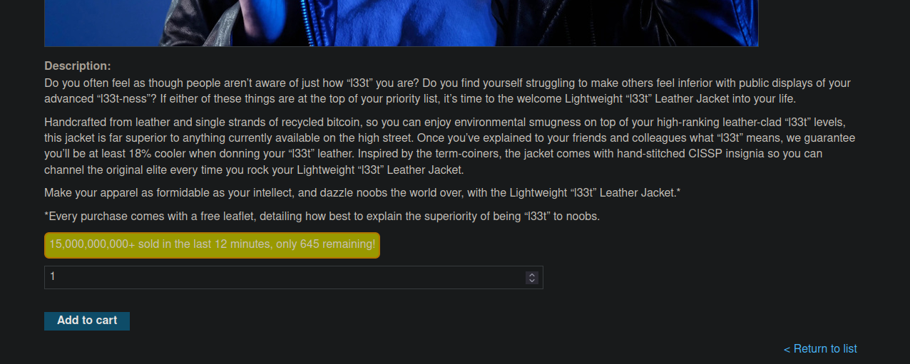
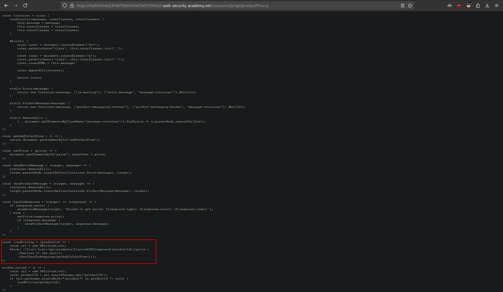
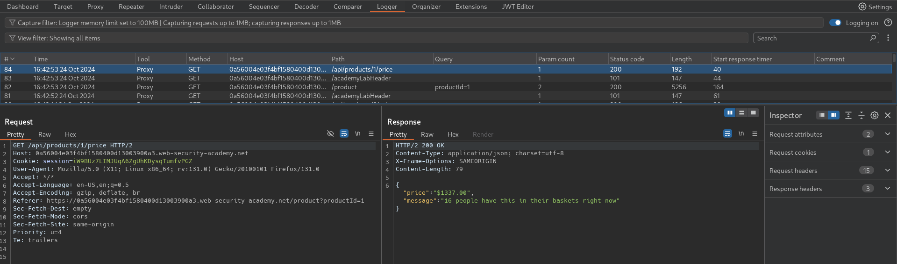
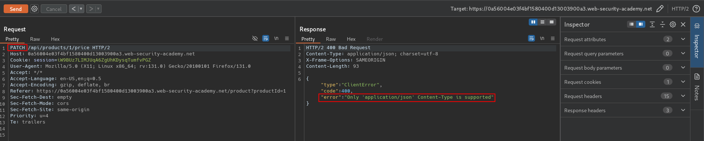
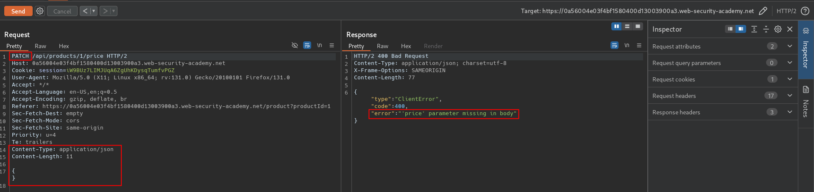
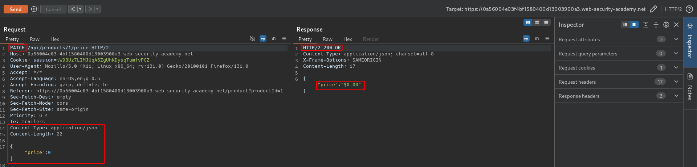
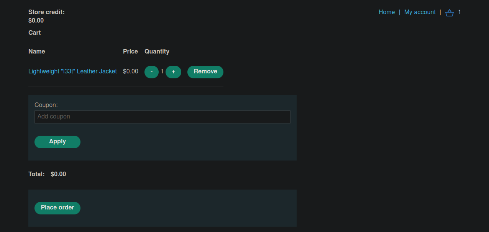

# Finding and exploiting an unused API endpoint
# Objective
To solve the lab, exploit a hidden API endpoint to buy a Lightweight l33t Leather Jacket. You can log in to your own account using the following credentials: `wiener:peter`.

To solve this lab, you'll need to know:
- How to use error messages to construct a valid request.
- How HTTP methods are used by RESTful APIs.
- How changing the HTTP method can reveal additional functionality.

# Solution
## Analysis
### Identifying API endpoints

||
|:--:| 
| *Special information* |
||
| *Responsible JS code with API endpoint* |
||
| *API endpoint* |

### Identifying supported HTTP methods

```
GET - Retrieves data from a resource.
PATCH - Applies partial changes to a resource.
OPTIONS - Retrieves information on the types of request methods that can be used on a resource.
```

Method `PATCH` is used to apply partial modifications to a resource. Unlike the PUT method, which replaces the entire resource with the data provided, PATCH is designed for making updates to just a portion of the resource, without affecting other parts.

||
|:--:| 
| *PATCH request to found API endpoint* |
||
| *Price parameter is obligatory* |

## Exploitation
Using `PATCH` method attacker can attempt to modify price of an item.

||
|:--:| 
| *Price modyfication* |
||
| *Result - modified price* |
