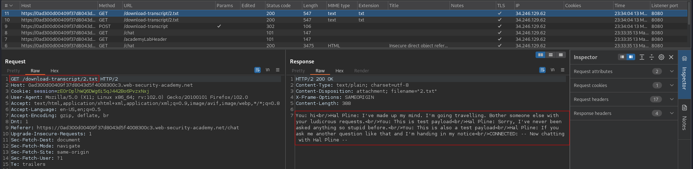
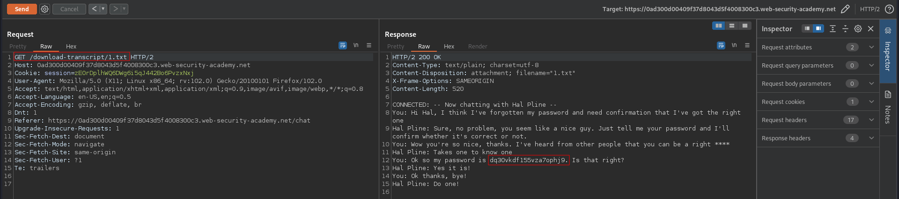

# Insecure direct object references
# Objective
This lab stores user chat logs directly on the server's file system, and retrieves them using static URLs.\
Solve the lab by finding the password for the user carlos, and logging into their account.

# Solution
The website in this lab allows to download transcript of conversations.
||
|:--:| 
| *Admin page URL is visible in source code* |
||
| *Carlos password was in file named 1.txt* |