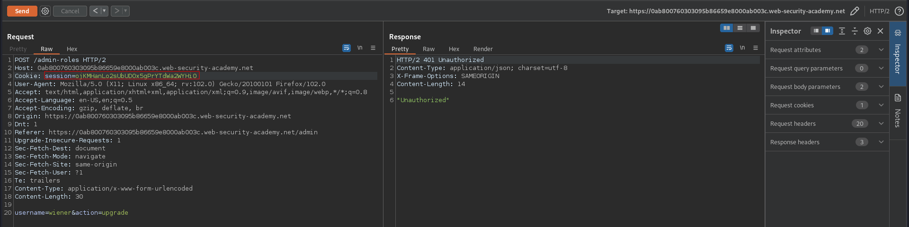
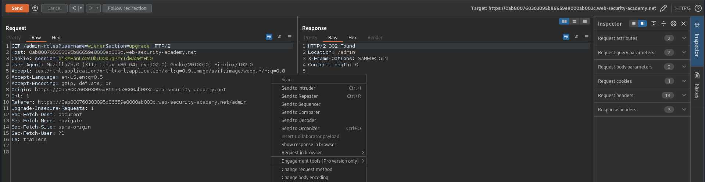

# Method-based access control can be circumvented
# Objective
This lab implements access controls based partly on the HTTP method of requests. You can familiarize yourself with the admin panel by logging in using the credentials `administrator:admin`.\
To solve the lab, log in using the credentials `wiener:peter` and exploit the flawed access controls to promote yourself to become an administrator.

# Solution
In this lab changing the request method allowed to change users role by an unauthorized user.

||
|:--:| 
| *POST method with chaged session cookie - sent by user wiener* |
||
| *GET Method instead of POST - There is a Change Request Method option* |