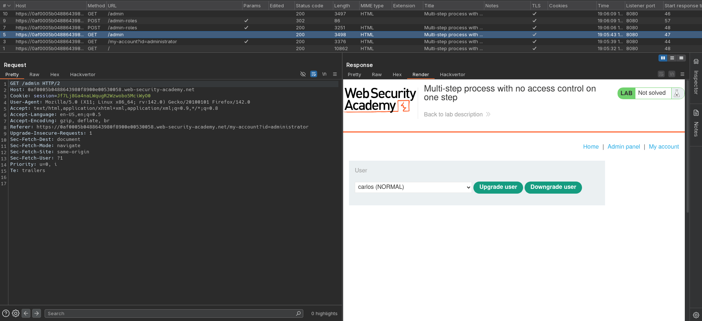
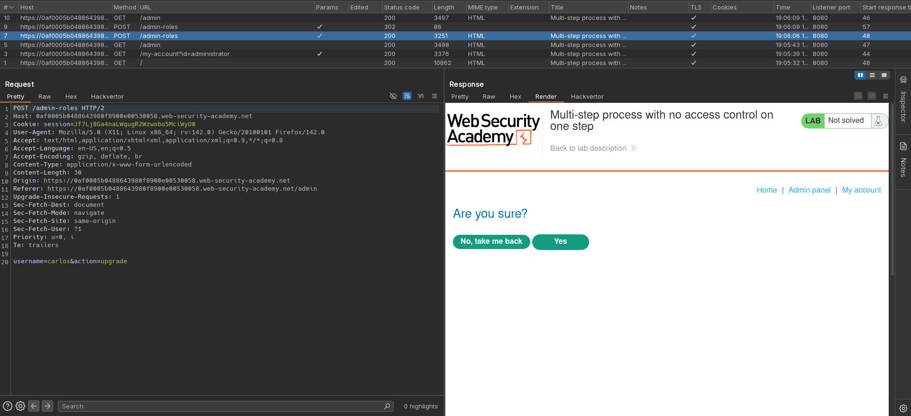
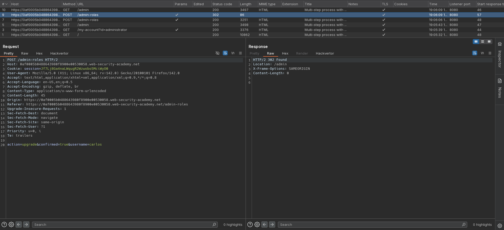
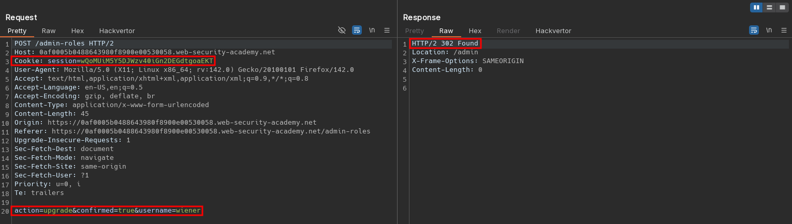

# Multi-step process with no access control on one step
# Objective
This lab has an admin panel with a flawed multi-step process for changing a user's role. \
You can familiarize yourself with the admin panel by logging in using the credentials `administrator:admin`.\
To solve the lab, log in using the credentials `wiener:peter` and exploit the flawed access controls to promote yourself to become an administrator. 

# Solution
## Analysis
Application has a `Upgrade user` feature to allow administrator to give different user higher privileges. The process has 2 steps: upgrade selected user, confirm action. Both of these action are handled by the same endpoint `/admin-roles`.

||
|:--:| 
| *Admin panel* |
||
| *First upgrade user request* |
||
| *Second upgrade user request - confirmation* |

## Exploitation
Trying to access `/admin-roles` endpoint from `wiener` account results in response `401 Unauthorized`. However, sending second step (confirmation) of `Upgrade user` sequence allows normal user to become administrator.

||
|:--:| 
| *Elevating privileges from normal user account* |
