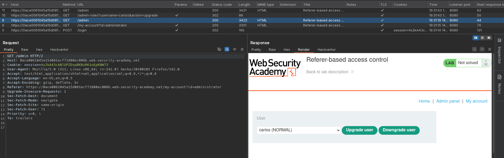

# Referer-based access control
# Objective
This lab controls access to certain admin functionality based on the Referer header.\
You can familiarize yourself with the admin panel by logging in using the credentials `administrator:admin`.\
To solve the lab, log in using the credentials `wiener:peter` and exploit the flawed access controls to promote yourself to become an administrator. 

# Solution
## Analysis
Application has a `Upgrade user` feature to allow administrator to give different user higher privileges. The process has 2 steps: upgrade selected user, confirm action. Both of these action are handled by the same endpoinnt `/admin-roles`.

||
|:--:| 
| *Admin panel* |
||
| *Upgrade user request* |

When `Referer: https://<id>.web-security-academy.net/admin` header was changed to `Referer: https://<id>.web-security-academy.net/admin`, website responds with `401 Unauthorized`.
||
|:--:| 
| *Upgrade user request without correct endpoint in Referer header* |

## Exploitation
Trying to access `/admin-roles` endpoint from `wiener` account results in response `401 Unauthorized`. However, sending `Upgrade user` request with `Referer: https://<id>.web-security-academy.net/admin` allows normal user to become administrator.

||
|:--:| 
| *Elevating privileges from normal user account* |

