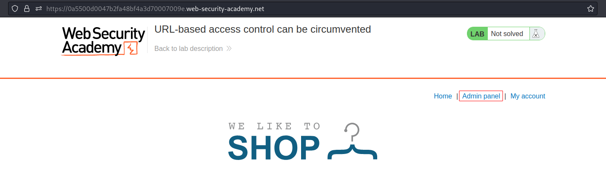
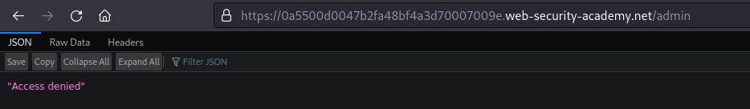
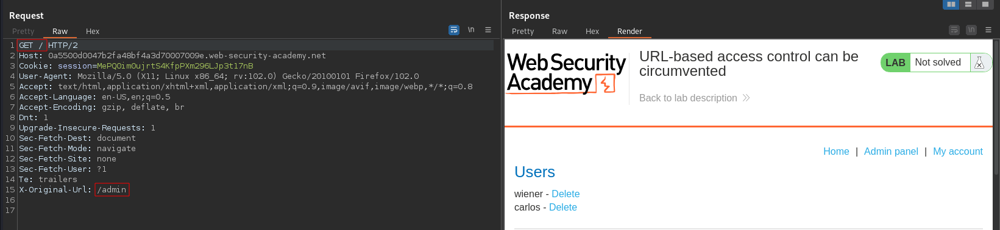
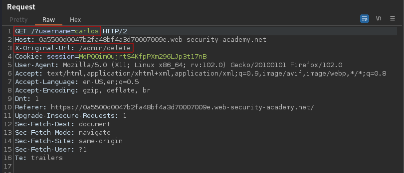

# URL-based access control can be circumvented
# Objective
This website has an unauthenticated admin panel at `/admin`, but a front-end system has been configured to block external access to that path.\ However, the back-end application is built on a framework that supports the `X-Original-URL` header.\
To solve the lab, access the admin panel and delete the user carlos.

# Solution
## Analysis
||
|:--:| 
| *Admin panel is visible on the website* |
||
| *Access to admin panel is denied* |

## Exploitation
Headers `X-Original-URL` or `X-Rewrite-URL` can be used in some cases to bypass restrictions. In this case `X-Original-URL` allowed to get access to admin panel and then delete user carlos.
||
|:--:| 
| *Access to admin panel* |
||
| *Deletion of user carlos* |
