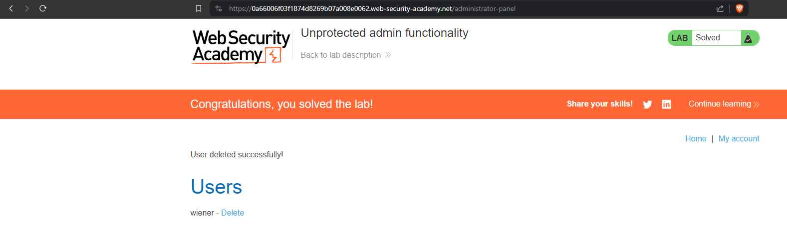

# Unprotected admin functionality
# Objective
This lab has an unprotected admin panel.\
Solve the lab by deleting the user carlos.

# Solution
`Robots.txt` file shows that `/administrator-panel` exists.

||
|:--:| 
| *Deletion of user carlos* |