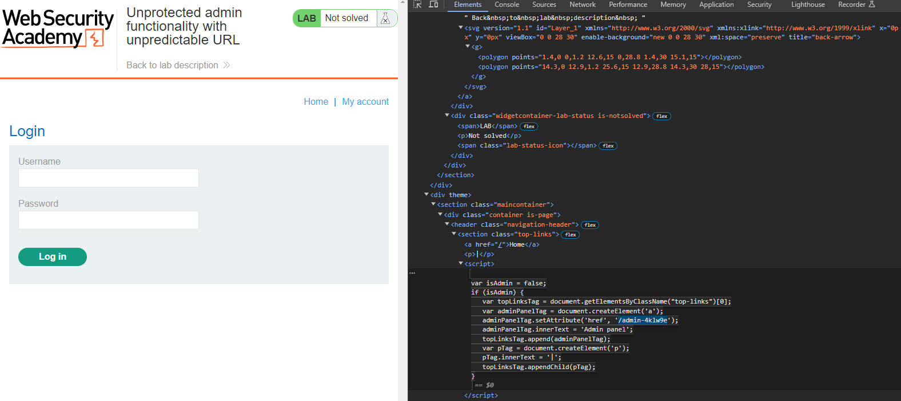

# Unprotected admin functionality with unpredictable URL
# Objective
This lab has an unprotected admin panel. It's located at an unpredictable location, but the location is disclosed somewhere in the application.\
Solve the lab by accessing the admin panel, and using it to delete the user carlos.

# Solution
Admin page URL might be disclosed in JavaScript that constructs the user interface based on the user's role.

||
|:--:| 
| *Admin page URL is visible in source code* |