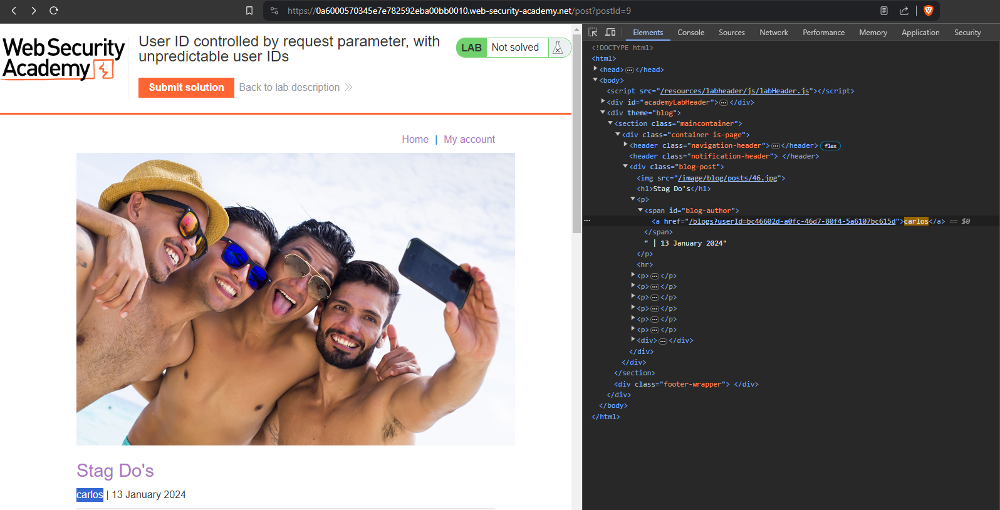
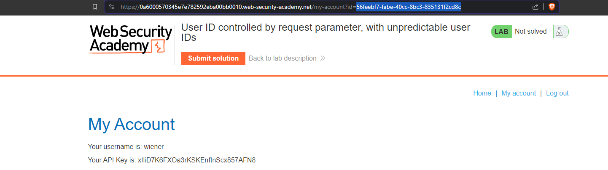
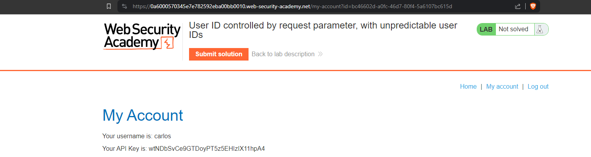

# User ID controlled by request parameter, with unpredictable user IDs
# Objective
This lab has a horizontal privilege escalation vulnerability on the user account page, but identifies users with GUIDs.\
To solve the lab, find the GUID for carlos, then submit his `API key` as the solution.\
You can log in to your own account using the following credentials: `wiener:peter`

# Solution
Some applications uses unpredictable GUIDs to control and address users (instead of predictible IDs). These `GUIDs` (globally unique identifier) migth be disclosed somewhere on the website to identify users. In this lab GUID of user carlos was disclosedin one of the posts.

||
|:--:| 
| *GUID of user carlos* |

After pasting carlos `GUID` in URL it is possible to get his `API Key`.

||
|:--:| 
| *Before* |
||
| *After - Access to carlos API Key* |
