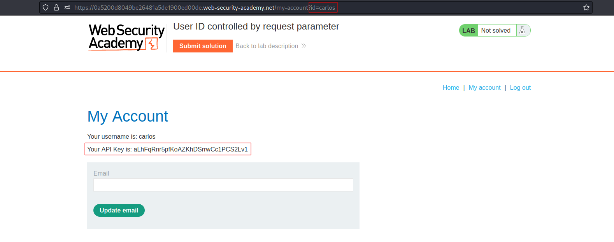

# User ID controlled by request parameter
# Objective
 This lab has a horizontal privilege escalation vulnerability on the user account page.\
To solve the lab, obtain the API key for the user carlos and submit it as the solution.\
You can log in to your own account using the following credentials: `wiener:peter`

# Solution
After logging in as `wiener`, it is possible to see `carlos` welcome page by changing `id` value in URL:

||
|:--:| 
| *Changed id value in URL* |
