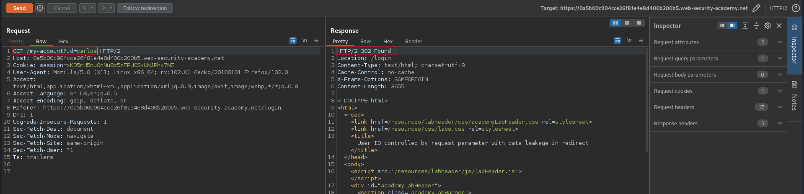
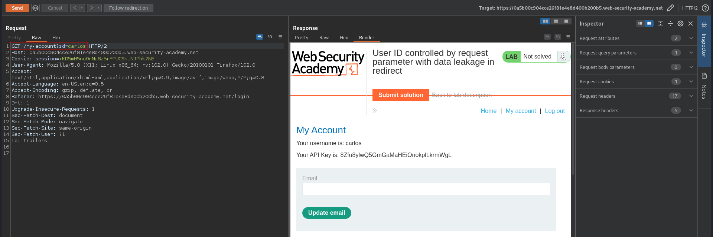

# User ID controlled by request parameter with data leakage in redirect 
# Objective
This lab contains an access control vulnerability where sensitive information is leaked in the body of a redirect response.\
To solve the lab, obtain the API key for the user carlos and submit it as the solution.\
You can log in to your own account using the following credentials: `wiener:peter`

# Solution
Changing the `id` value allows to see other user welcome page
||
|:--:| 
| *Reddirection to carlos page* |
||
| *Carlos's welcome page* |