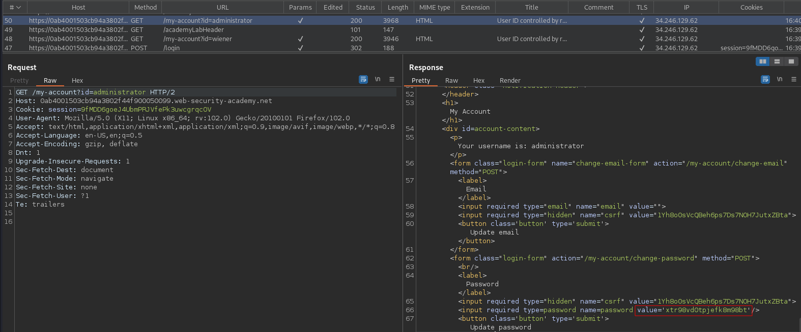

# User ID controlled by request parameter with password disclosure
# Objective
This lab has user account page that contains the current user's existing password, prefilled in a masked input.\
To solve the lab, retrieve the administrator's password, then use it to delete the user carlos.\
You can log in to your own account using the following credentials: `wiener:peter`

# Solution
Modification of parameter value in URL allows to get to administrator account page.
Original - `/my-account?id=wiener`
Modified - `/my-account?id=administrator`

||
|:--:| 
| *Administrator's password* |