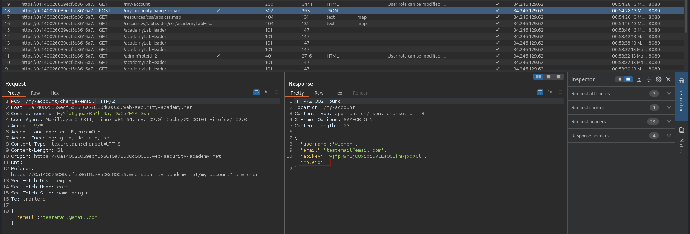
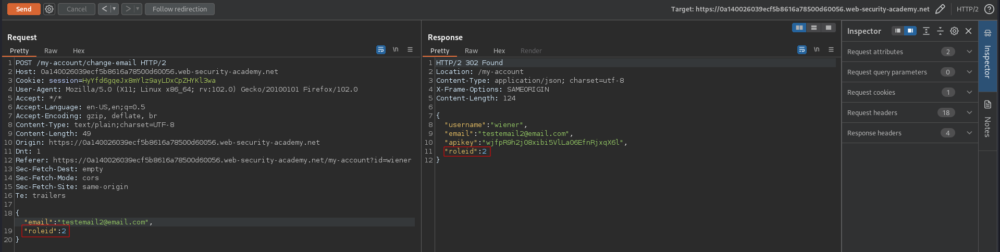

# User role can be modified in user profile
# Objective
This lab has an admin panel at `/admin`. It's only accessible to logged-in users with a `roleid` of `2`.\
Solve the lab by accessing the admin panel and using it to delete the user carlos.\
You can log in to your own account using the following credentials: `wiener:peter`

# Solution
## Analysis
The `roleid` can be spotted in response from `/my-account/change-email`:

||
|:--:| 
| *There is a roleid in response* |

## Changing roleid
By adding `"roleid":2` to `/my-account/change-email` request, user can change his `roleid` and get access to `/admin`.

||
|:--:| 
| *Modified change email request* |
