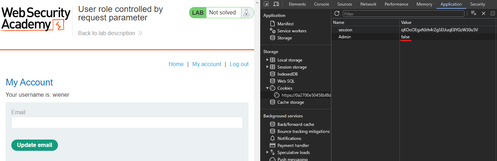
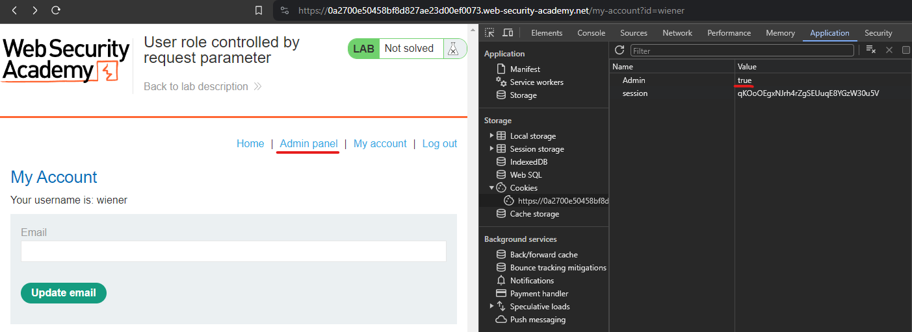
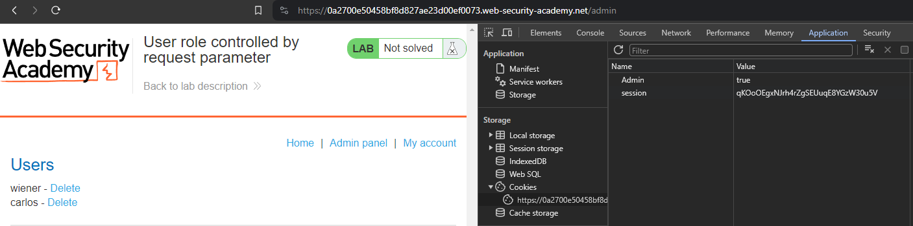

# User role controlled by request parameter
# Objective
This lab has an admin panel at `/admin`, which identifies administrators using a forgeable cookie.\
Solve the lab by accessing the admin panel and using it to delete the user carlos.\
You can log in to your own account using the following credentials: `wiener:peter`

# Solution
The website has a forgeable cookie: `Admin`.

||
|:--:| 
| *Forgeable cookie Admin* |

After cookie modification it is possible to access `/admin` page.

||
|:--:| 
| *Modified cookie* |
||
| *Admin panel* |