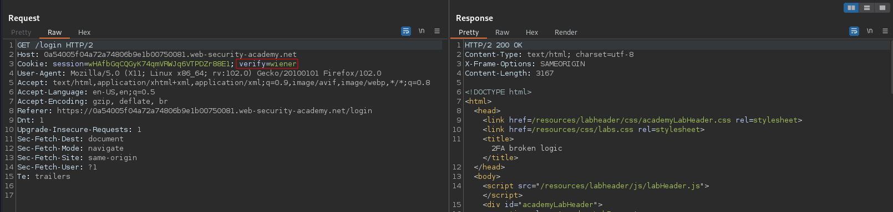
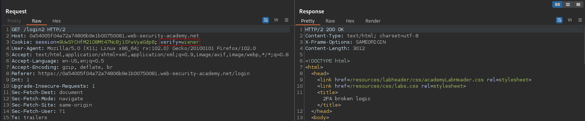
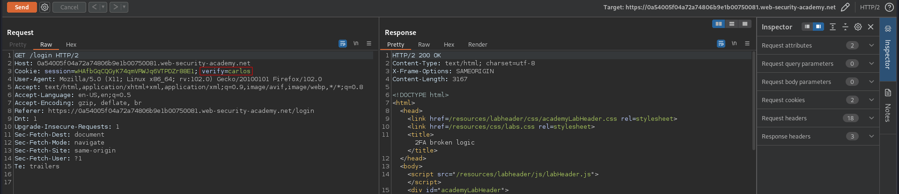
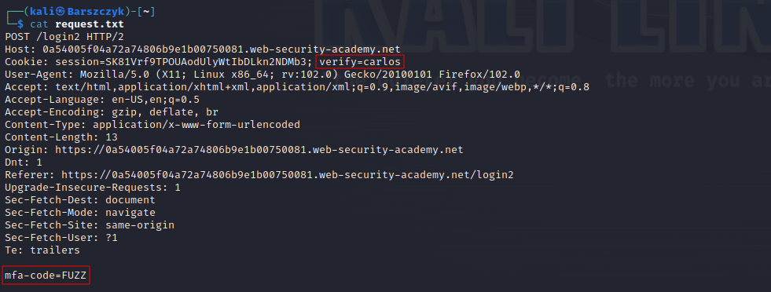
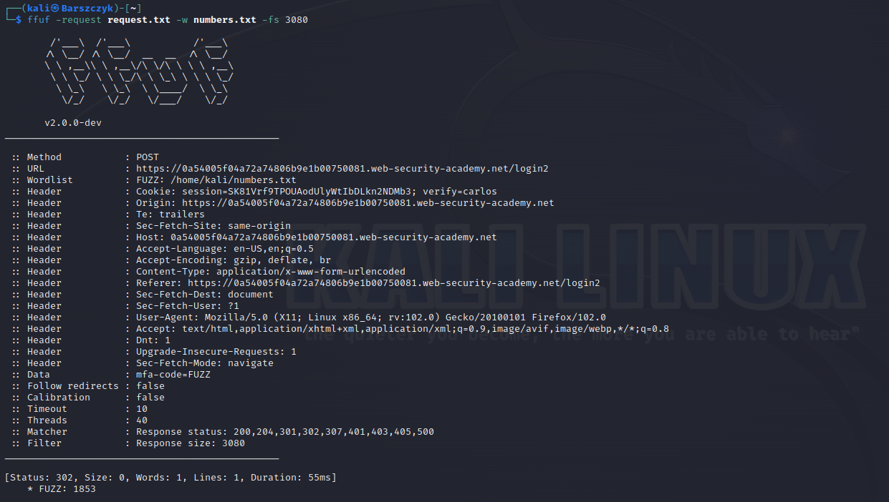

# 2FA broken logic
# Objective
This lab's two-factor authentication is vulnerable due to its flawed logic. To solve the lab, access Carlos's account page.

Your credentials: `wiener:peter`\
Victim's username: `carlos`

You also have access to the email server to receive your 2FA verification code.

# Solution
Exploitation steps:
1. Try to login as victim - 2FA code will be send to victim's email.
2. Try to login as attacker - Analyze request that sends 2FA codes.
4. After receiving session cookies check for potentially personalized cookies (for example username or user id).
5. Modify personalized cookie value to victim's cookie value.
6. Brute force 2FA code if there is no 2FA brute force protection.

## Analysis
The GET request to `/login` revils a personalized cookie named `verify`. Modification of verify cookie will generate 2FA code for user carlos. Thanks to this attacker can use his own credentials to login (`wiener:peter`) and then brute force 2FA code of the victim (if there is no brute force protection). 
Exploitation steps:
1. Try to login as victim - modify `verify` cookie to trigger generation of 2FA code
2. Try to login as attacker
3. Modify `verify` cookie and brute force 2FA code and access victim account

||
|:--:| 
| *GET request to login page - login by passing credentials* |
||
| *GET request to login2 page - Login by passing 2FA code* |

## Exploitation
```
seq -w 0000 9999 > numbers.txt
ffuf -request request.txt -w numbers.txt -fs 3080
```
||
|:--:| 
| *Modification of personalized cookie - 2FA code generation for victim* |
||
| *Modified POST request to brute force 2FA code* |
||
| *Brute force result* |