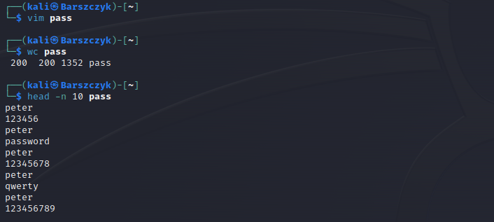
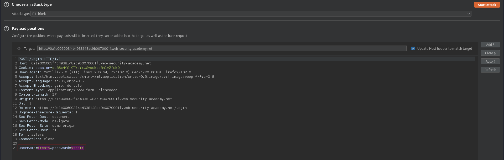
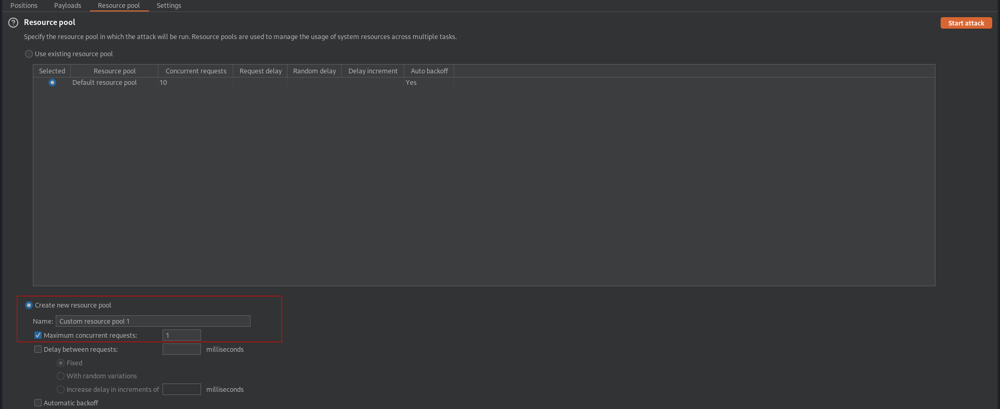
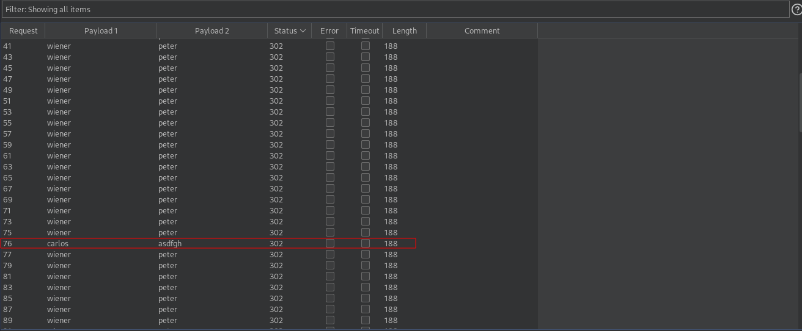

# Broken brute-force protection, IP block
# Objective
This lab is vulnerable due to a logic flaw in its password brute-force protection. To solve the lab, brute-force the victim's password, then log in and access their account page.
- Your credentials: wiener:peter
- Victim's username: carlos
- [passwords.txt](https://portswigger.net/web-security/authentication/auth-lab-passwords) 

# Solution
In this application the counter for the number of failed attempts resets if the IP owner logs in successfully, therefore it is possible to brute-force someone password by alternating successful and possible failed logins attempts.

||
|:--:| 
| *Creating usernames payload set* |
||
| *Creating passwords payload set* |
||
| *Payloads positions* |
||
| *Ensure that only 1 request is send at a time* |
||
| *Brute-forced password - asdfgh* |
