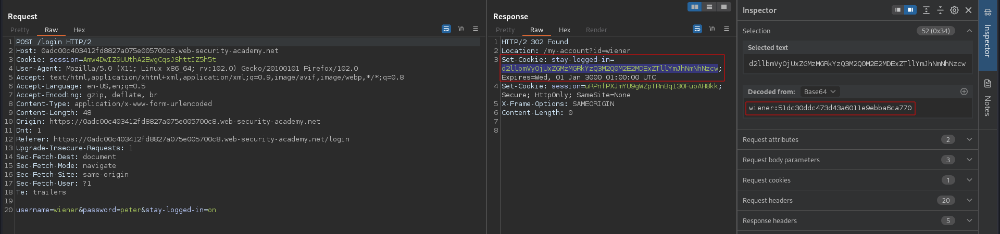
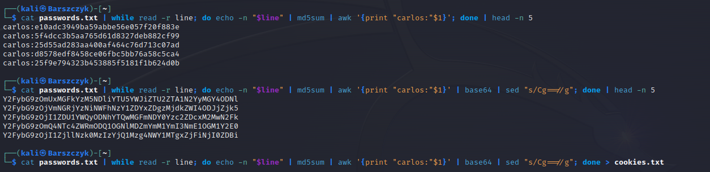
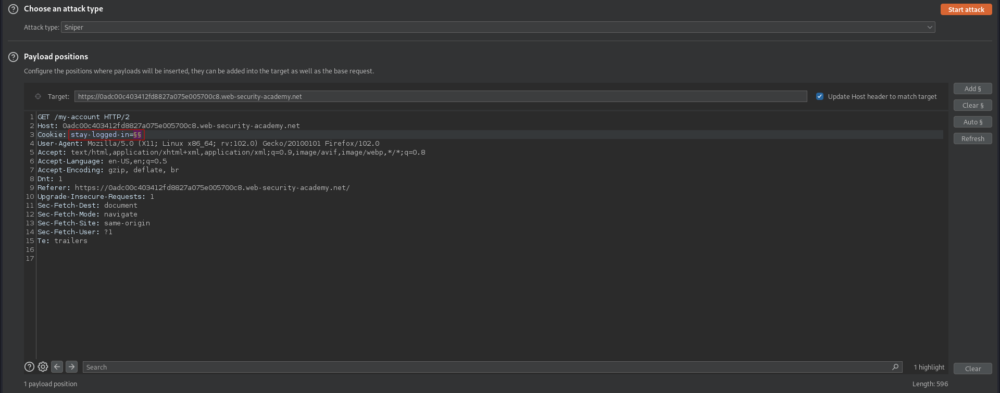
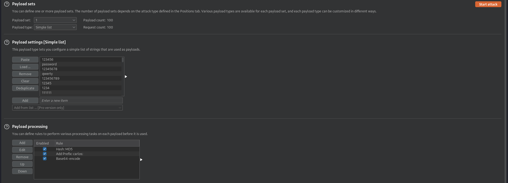
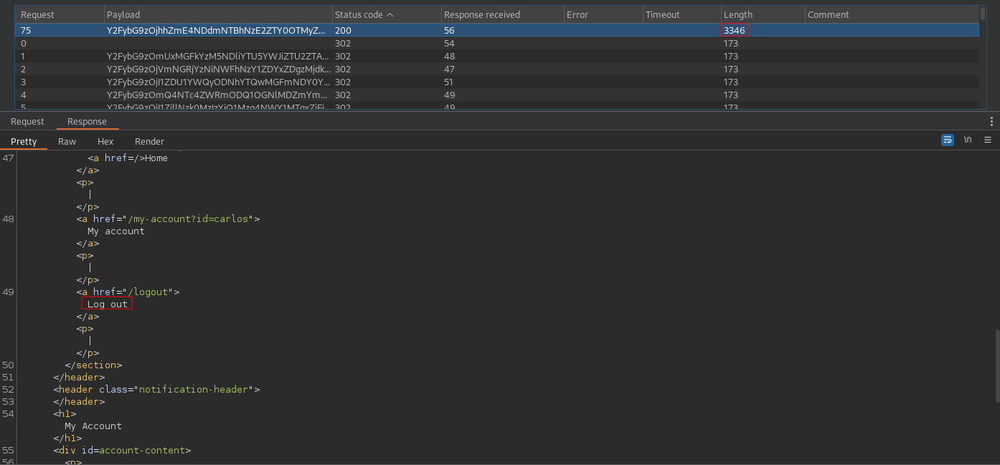

# Brute-forcing a stay-logged-in cookie
# Objective
This lab allows users to stay logged in even after they close their browser session. The cookie used to provide this functionality is vulnerable to brute-forcing. To solve the lab, brute-force Carlos's cookie to gain access to his "My account" page.

Your credentials: `wiener:peter`\
Victim's username: `carlos`\
[Candidate passwords](https://portswigger.net/web-security/authentication/auth-lab-passwords)

# Solution
## Analysis
||
|:--:| 
| `stay-logged-in` cookie value |
||
| `stay-logged-in` cookie construction |

Cookie construction:
```
base64(username+':'+md5(user_password))
```

## Exploitation
||
|:--:| 
| *Preparation of brute force list* |
||
| *Payload position* |
||
| *Payload modifications using Burp Suite payload processing* |
||
| *Brute force result* |
