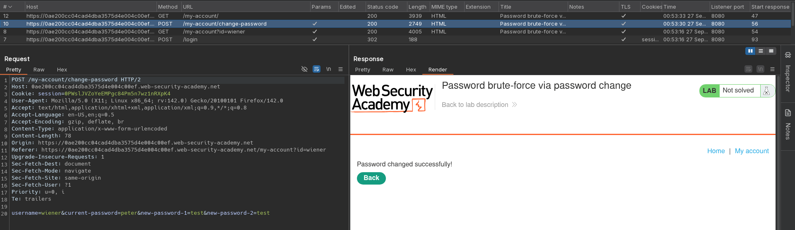
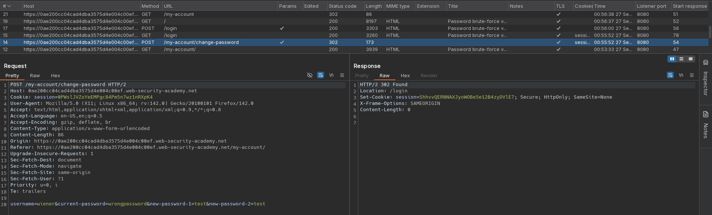
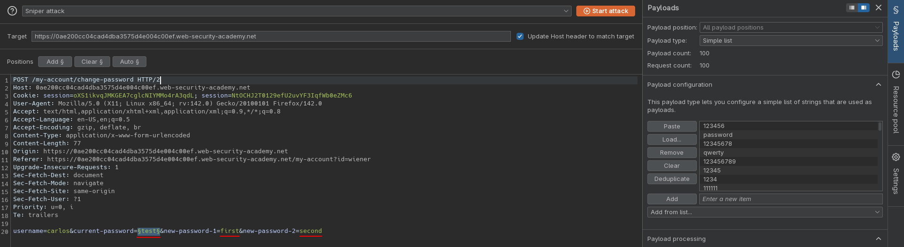
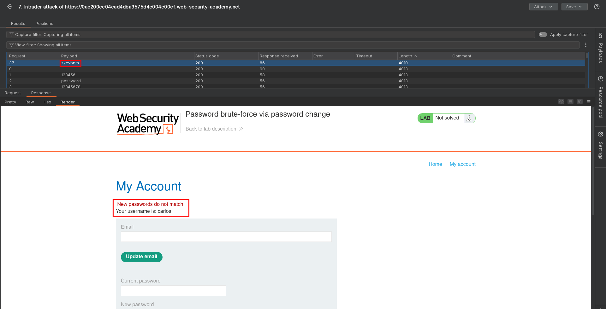

# Password brute-force via password change
# Objective
This lab's password change functionality makes it vulnerable to brute-force attacks. 

To solve the lab, use the list of candidate passwords to brute-force Carlos's account and access his "My account" page.

- Your credentials: `wiener:peter`
- Victim's username: `carlos`
- [Candidate passwords](https://portswigger.net/web-security/authentication/auth-lab-passwords)

# Solution
## Analysis
In this lab user can change his password. If wrong old password is provided, user is redirected to `/login` and have to login with old password. Moreover, user's acount is blocked for one minute.

||
|:--:| 
| *Change password funcionality* |
||
| *Change password funcionality - wrong old password* |

## Exploitation
Attacker can brute force user password by abusing change password funcionality. One minute account block can be bypassed by providing non matching new passwords. Message `New passwords do not match" will indicate correct old password.

||
|:--:| 
| *Intruder configuration* |
||
| *Correct (old) victim's password* |
