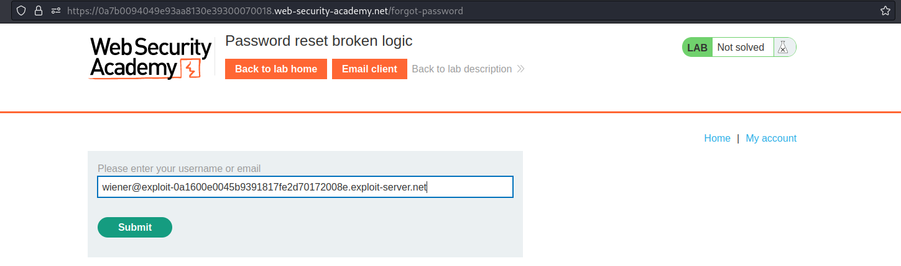
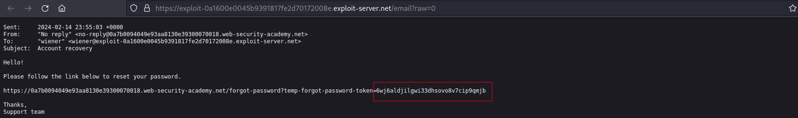
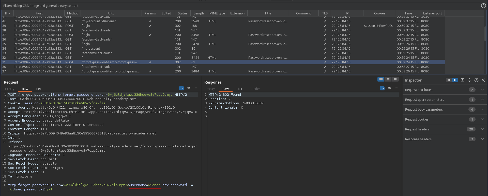

# Password reset broken logic
# Objective

This lab's password reset functionality is vulnerable. To solve the lab, reset Carlos's password then log in and access his "My account" page.
- Your credentials: wiener:peter
- Victim's username: carlos

# Solution
||
|:--:| 
| *Reseting password* |
||
| *Password reset email with password reset token* |

Token could be used more than once, therefore it allows to reset passwords of others users.\
This token should expire after one use and should be tied to one specific user.

||
|:--:| 
| *New password for user carlos* |
