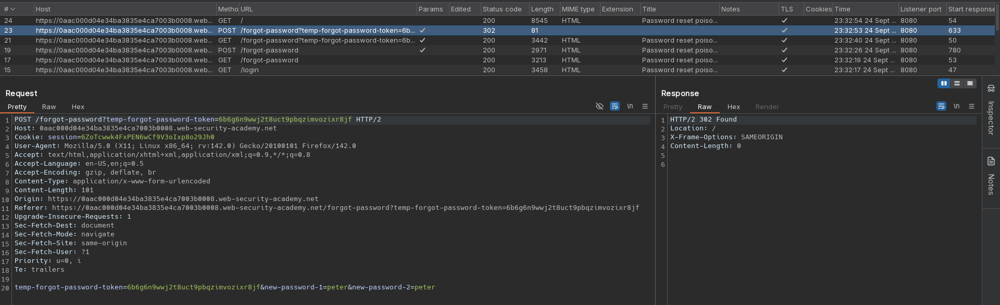

# Password reset poisoning via middleware
# Objective
This lab is vulnerable to password reset poisoning. The user carlos will carelessly click on any links in emails that he receives. 

To solve the lab, log in to Carlos's account. You can log in to your own account using the following credentials: `wiener:peter`. Any emails sent to this account can be read via the email client on the exploit server. 

# Solution
## Analysis
||
|:--:| 
| *Reseting password funcionality* |
||
| *Password reset link sent to user via email* |
||
| *Setting new password* |

## Exploitation
Using `X-Forwarded-Host` attacker can create forgot password link with other domain. When victim's tries to open the link, attacker will have access to victim's reset password token.

||
|:--:| 
| *Password reset poisoning* |
||
| *Reset password link with attacker's domain* |

||
|:--:| 
| *Reseting victim's password* |
||
| *Victim request to attacker domain with password reset token* |
||
| *Reseting victim's password* |
