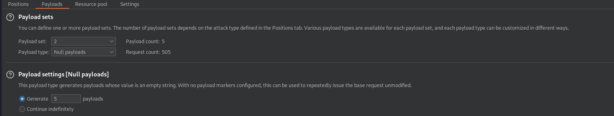
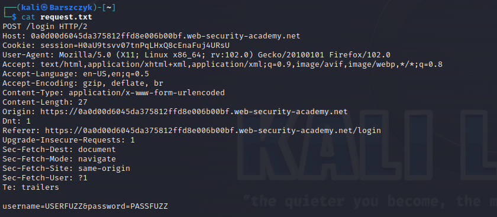
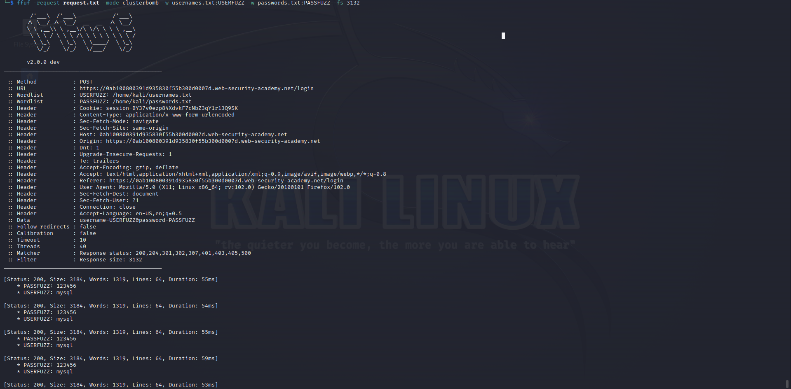
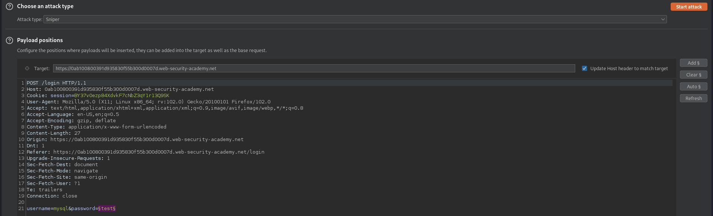
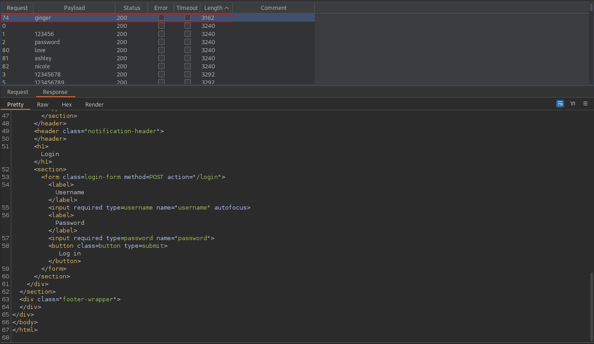

# Username enumeration via account lock
# Objective
This lab is vulnerable to username enumeration. It uses account locking, but this contains a logic flaw. To solve the lab, enumerate a valid username, brute-force this user's password, then access their account page.
- [username.txt](https://portswigger.net/web-security/authentication/auth-lab-usernames) 
- [passwords.txt](https://portswigger.net/web-security/authentication/auth-lab-passwords) 

# Solution
In this application if the username is valid account will be blocked - the response will be differennt
## Usename enumeration
||
|:--:| 
| *Payloads positions* |
||
| *Payload settings* |

The setup above would work but the community version of Burp Suite is to slow to trigger account lock out. Because of this I used ffuf to enumerate usernames.

```
ffuf -request request.txt -mode clusterbomb -w usernames.txt:USERFUZZ -w passwords.txt:PASSFUZZ -fs 3132
```

||
|:--:| 
| *request.txt* |
||
| *ffuf enumeration* |

Valid username is mysql

## Password brute-force
||
|:--:| 
| *Payload position* |
||
| *Brute-forced password - ginger* |