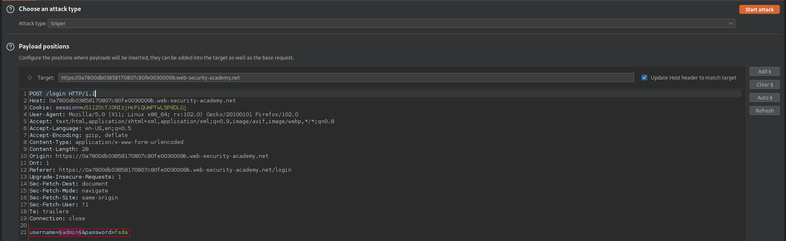
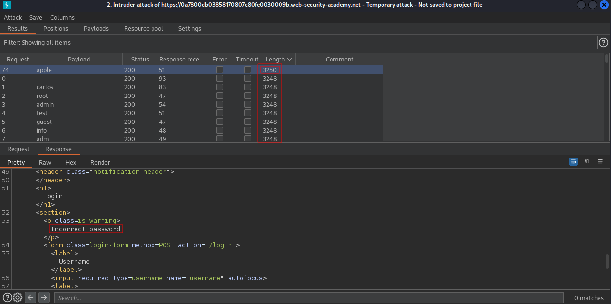
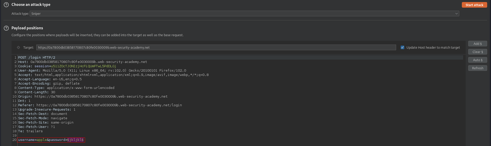
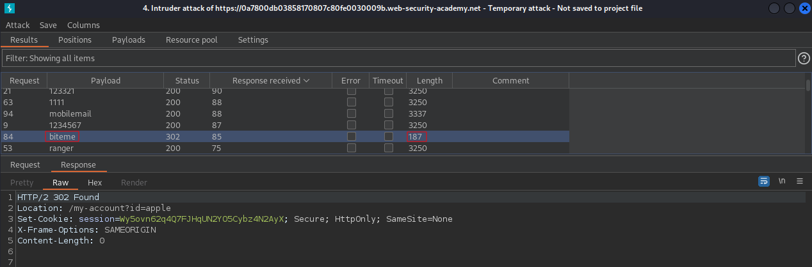

# Objective
This lab is vulnerable to username enumeration and password brute-force attacks. It has an account with a predictable username and password, which can be found in the following wordlists: \
[username.txt](https://portswigger.net/web-security/authentication/auth-lab-usernames) \
[passwords.txt](https://portswigger.net/web-security/authentication/auth-lab-passwords) \
To solve the lab, enumerate a valid username, brute-force this user's password, then access their account page.
# Solution
## Username enumeration
||
|:--:| 
| *Payload position* |

After enumerating usernamas there was one valid username -Response was a little bit longer. \

|:--:| 
| *Valid username - apple* |
## Password Brute-force
||
|:--:| 
| *Payload position* |
||
|:--:| 
| *Valid password for user apple - biteme* |
